# PHY6222

# Bluetooth LE 5.2 System on Chip

# Key Features

• ARM® Cortex™-M0 32-bit processor with SWD 

• Memory 

 128KB-8MB in-system flash memory 

 64KB SRAM, all programmable retention in sleep mode 

 4-way instruction cache with 8KB Cache RAM 

 96KB ROM 

 256bit efuse 

• 22 general purpose I/O pins 

 GPIO status retention in off/sleep mode 

 configurable as serial interface and programmable IO MUX function mapping 

 All pins can be configured for wake-up 

 All pins for triggering interrupt 

 3 quadrature decoder(QDEC) 

 6-channel PWM 

 2-channel PDM/I2C/SPI/UART 

 4-channel DMA 

• DMIC/AMIC with microphone bias 

• 8-channel 12bit ADC with low noise voice PGA 

• 6-channel 32bit timer, one watchdog timer 

• Real timer counter (RTC) 

• Power, clock, reset controller 

• Flexible power management 

 Operating Voltage range 1.8V to 3.6V 

 Embedded buck DC-DC and LDOs 

 Battery monitor 

• Power consumption 

 0.3μA @ OFF Mode (IO wake up only) 

 1μA @ Sleep Mode with 32KHz RTC 

 13uA @ Sleep Mode with 32KHz RTC and all SRAM retention 

 Receive mode: 4mA @3.3V power supply 

 Transmit mode: 4.6mA (0dBm output power) @3.3V power supply 

 MCU: <60uA/MHz 

• RC oscillator hardware calibrations 

 Internal High/Low frequency RC osc 

 32KHz RC osc for RTC with +/-500ppm accuracy 

 32MHz RC osc for HCLK with 3% accuracy 

• High Speed Throughput 

 Support BLE 2Mbps Protocol 

 Support Data Length Extension 

 Throughput up to 1.6Mbps (DLE+2Mbps) 

• AoA/AoD Direction Finding 

• Support SIG-Mesh Multi-Feature 

 Friend Node 

 Low Power Node 

 Proxy Node 

 Relay Node 

• 2.4 GHz transceiver 

 Compliant to Bluetooth 5.2 

 Sensitivity: 

-99dBm@BLE 1Mbps data rate 

-105dBm@BLE 125Kbps data rate 

 TX Power -20 to +10dBm in 3dB steps 

 Single-pin antenna: no RF matching or RX/TX switching required 

 RSSI (1dB resolution) 

 Antenna array and optional off-chip RF PA/LNA control interface 

• AES-128 encryption hardware 

• Link layer hardware 

 Automatic packet assembly 

 Automatic packet detection and validation 

 Auto Re-transmit 

 Auto ACK 

 Hardware Address Matching 

 Random number generator 

• Operating temperature: 

$= - 4 0 ^ { \circ } C ^ { \sim } + 8 5 ^ { \circ } C$ (Consumer) 

 -40 ˚C ~+105 ˚C (Industrial) 

• RoHS Package: QFN32(4mm x 4mm)/ QFN24(3mm x 3mm) 

• Applications: wearables, beacons, home and building, health and medical, industrial and manufacturing, retail and payment, data transmission, PC/mobile/TV peripherals, internet of things (IoT) 

# Liability Disclaimer

Phyplus Microelectronics Limited reserves the right to make changes without further notice to the product to improve reliability, function or design. Phyplus Microelectronics Limited does not assume any liability arising out of the application or use of any product or circuits described herein. 

# Life Support Applications

Phyplus Microelectronics Limited’s products are not designed for use in life support appliances, devices, or systems where malfunction of these products can reasonably be expected to result in personal injury. Phyplus Microelectronics Limited customers using or selling these products for use in such applications do so at their own risk and agree to fully indemnify Phyplus Microelectronics Limited for any damages resulting from such improper use or sale. 

# Contact Details

For your nearest dealer, please see www.phyplusinc.com. 

Information regarding product updates, downloads, and technical support can be accessed through our homepage. 

# Main Office

# Shanghai

3F&4F, Building 23, Lane 676, Wuxing Road, Pudong New District, Shanghai, China 

Phone: +86 21 5899 0018 

Email: info@phyplusinc.com 

# Shenzhen

Room 1205, No.10 Li Shan Road, Shenzhen China 


Revision History


<table><tr><td>Date</td><td>Version</td><td>Description</td></tr><tr><td>2020.11</td><td>1.0</td><td></td></tr><tr><td>2020.12</td><td>1.1</td><td>The following content has been added or updated:“3.6.1.5 UVLO” on page 11: Added the content of UVLO.</td></tr><tr><td>2021.4</td><td>1.2</td><td>The following content has been added, updated or corrected:“Operating Temperature” on cover: Added the temperature information of “Consumer” and “Industrial”.“6 Operating Conditions” on page 31: Added the temperature specification of “Consumer” and “Industrial” in Table 19.Sensitivityupdated: “-99dBm@1Mbps”, “-105dBm@BLE 125Kbps”, “-100dBm@500Kbps” and “-96dBm@2Mbps”, on cover, page 18 ‘4.1 2.4GHz Radio’, page 31 to page 34 from ‘table 23’ to ‘table 24’.Message of 2.4GHz transceiverhas been updated to “Compliant to Bluetooth 5.2”, on cover.GPIO Application Notescorrected: “GPIO_P00 Default ‘IN’” and “GPIO_P02 Default ‘OUT’”, on page 16, table 10.Content ofPower monitor glitch resethas been deleted.Sleep currentupdated: “3.5uA @ Sleep Mode with 32KHz RTC and all SRAM retention” on cover.</td></tr><tr><td>2021.6</td><td>1.3</td><td>The following content has been added, updated or corrected:“9 Ordering Information” and “10 Chip Marking” have been consolidated into one, on page 37.Sleep currentupdated: “13uA @ Sleep Mode with 32KHz RTC and all SRAM retention” on cover.GPIO Application Notescorrected: “IRQ Pins”, on page 17, table 10.</td></tr><tr><td>2021.7</td><td>1.3</td><td>The following content has been added, updated or corrected:Maximum MSLparameter updated: “Moisture Sensitivity Level: 3”.</td></tr><tr><td>2021.12</td><td>1.3</td><td>The following content has been added, updated or corrected:11.1 Sample Applicationupdated: VDDDEC capacitor of both reference design is 10nF now, page 38 and 39.</td></tr><tr><td>2022.7</td><td>1.3</td><td>The following content has been added, updated or corrected:3.2.5 Memory Address Mappingupdated: the physical address of RAM1, RAM2 and FLASH have been updated.9.3 Order Codeadded: Part No. PHY6222-H04I and related information</td></tr><tr><td>2023.3</td><td>1.4</td><td>Information of PHY6222QH QFN24 has been added.</td></tr></table>

# Table of Contents

# Revision History ..... 3

1 Introduction ............ 

2 Product Overview .......... 

2.1 Block Diagram ........ 

2.2 Pin Assignments and Functions ........... 

2.2.1 PHY6222QC (QFN32) ....... 

2.2.1.1 Pin Assignment .... 3 

2.2.1.2 Pin Functions ............ 

2.2.2 PHY6222QH (QFN24) ......... 

2.2.2.1 Pin Assignment .... 

2.2.2.2 Pin Functions ... 

# 3 System Block .......

3.1 CPU .. 

3.1.1 ARM M0 ...... 

3.2 Memory ............. 

3.2.1 ROM .. ... 10 

3.2.2 SRAM .... .....10 

3.2.3 FLASH ...... .... ....... 10 

3.2.4 eFuse .... ... 10 

3.2.5 Memory Address Mapping . . 10 

3.3 Boot and Execution Modes ......... 11 

3.3.1 Boot Loader .... . 11 

3.4 Power, Clock and Reset (PCR) ........ 12 

3.5 Power Management (POWER) ......... 12 

3.6 Low Power Features ... .14 

3.6.1 Operation and Sleep States ............ ..14 

3.6.1.1 Normal State ........... ...14 

3.6.1.2 Clock Gate State .... .14 

3.6.1.3 System Sleep State ........ ... 14 

3.6.1.4 System Off State ... .. 14 

3.6.1.5 UVLO .. .. 14 

3.6.2 State Transition ......... ..15 

3.6.2.1 Entering Clock Gate State and Wake-up .. 15 

3.6.2.2 Entering Sleep/off States and Wake-up ............ .15 

3.7 Interrupts .... . 15 

3.8 Clock Management ....... . 16 

3.9 IOMUX ...... 17 

3.10 GPIO ............ 19 

3.10.1 DC Characteristics .......... .... 20 

4 Peripheral Blocks .......... .21 

4.1 2.4GHz Radio .......... 21 

4.2 Timer/Counters (TIMER) ... . 21 

4.3 Real Time Counter (RTC) ........ . 21 

4.4 AES-ECB Encryption (ECB) .. .21 

4.5 Watchdog Timer (WDT) ..... .22 

4.6 SPI (SPI0, SPI1 Two Independent Instances) ........... .22 

4.7 I2C (I2c0, I2c1 Two Independent Instances) ........ . 22 

4.8 UART (UART0, UART1 Two Independent Instances) .............. . 22 

4.9 DMIC/AMIC Data Path ...... . 22 

4.9.1 Filter Chain Design ............... ...24 

4.9.2 Auto Mute Process .......... .... 25 

4.9.3 Digital Gain Control ........ ... 25 

4.9.4 Voice Compression ... .. 25 

4.10 Pulse Width Modulation (PWM) ......... ... 26 

4.11 Quadrature Decoder (QDEC) ...... .27 

4.12 Key Scan (KSCAN) ...... .27 

4.13 Analog to Digital Converter (ADC) with Programmable Gain Amplifier (PGA) ......... . 27 

4.13.1 PGA Path ...... .... 28 

4.13.2 ADC Path ...... .... 28 

4.13.3 ADC Channel <3:0> Connectivity ............... ........... 30 

5 Absolute Maximum Ratings ............. .. 32 

6 Operating Conditions ... ..33 

7 Radio Transceiver ........... ... 34 

7.1 Radio Current Consumption .. . 34 

7.2 Transmitter Specification ......... . 34 

7.3 Receiver Specification .. . 34 

7.3.1 BLE 1Mbps GFSK RX ... .34 

7.3.2 BLE 2Mbps GFSK RX ...... .35 

7.3.3 500Kbps GFSK RX .. 35 

7.3.4 125Kbps GFSK RX .... . 36 

7.4 RSSI Specifications ....... . 37 

8 Glossary ..................... ................. 38 

9 Ordering information ............ . 39 

9.1 Chip Marking Example ............ . 39 

9.2 Chip Marking Rule ............ ..39 

9.3 Order Code ............ .... 40 

10 Package dimensions .... . 41 

11 Sample Application and Layout Guide . .. 42 

11.1 Sample Application (PHY6222QC QFN32) ....... .42 

11.1.1 With DCDC ..... ..... 42 

11.1.2 Without DCDC ..... .... 44 

11.2 Sample Application (PHY6222QH QFN24) .......... ..... 44 

11.2.1 With DCDC ..... ..... 44 

11.2.2 Without DCDC ....... ...... 45 

11.3 Layout Guide ............ . 45 

11.3.1 Placement ... ... 45 

11.3.2 Bypass Capacitor .... . 45 

11.3.3 Layer Definition ........... ...... 46 

11.3.4 Reference clock and trace .... .. 46 

11.3.5 Power line or plane ..... ....46 

11.3.6 Ground Via ............... .............. 46 

# 1 Introduction

PHY6222 is a System on Chip (SoC) for Bluetooth LE 5.2applications. It has ARM® Cortex™-M0 32-bit processer with 64K retention SRAM, 128KB-8MB flash, 96KB ROM, 256bit efuse, and an ultra-low power, high performance, multi-mode radio. Also, PHY6222 can support BLE with security, application and over-the-air download update. Serial peripheral IO and integrated application IP enables customer product to be built with minimum bill-of-material (BOM) cost. 

# 2 Product Overview

# 2.1 Block Diagram

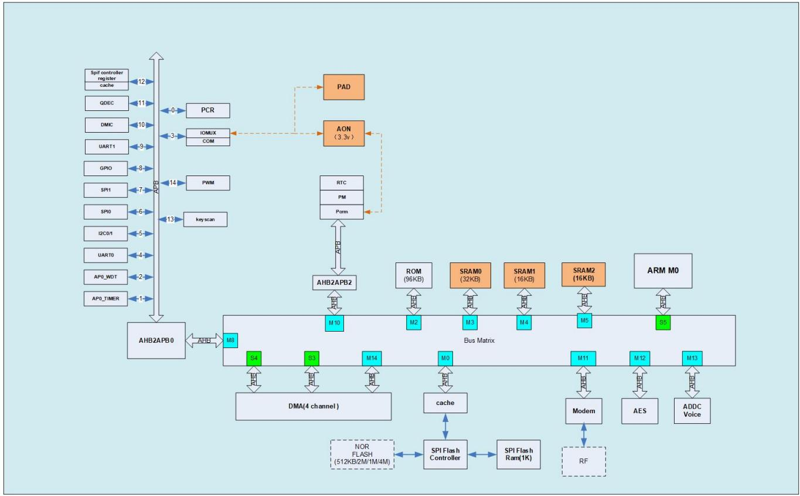


Figure 1: PHY6222 block diagram


# 2.2 Pin Assignments and Functions

This section describes the pin assignment and the pin functions for the package type of QFN32 and QFN24. 

# 2.2.1 PHY6222QC (QFN32)

# 2.2.1.1 Pin Assignment

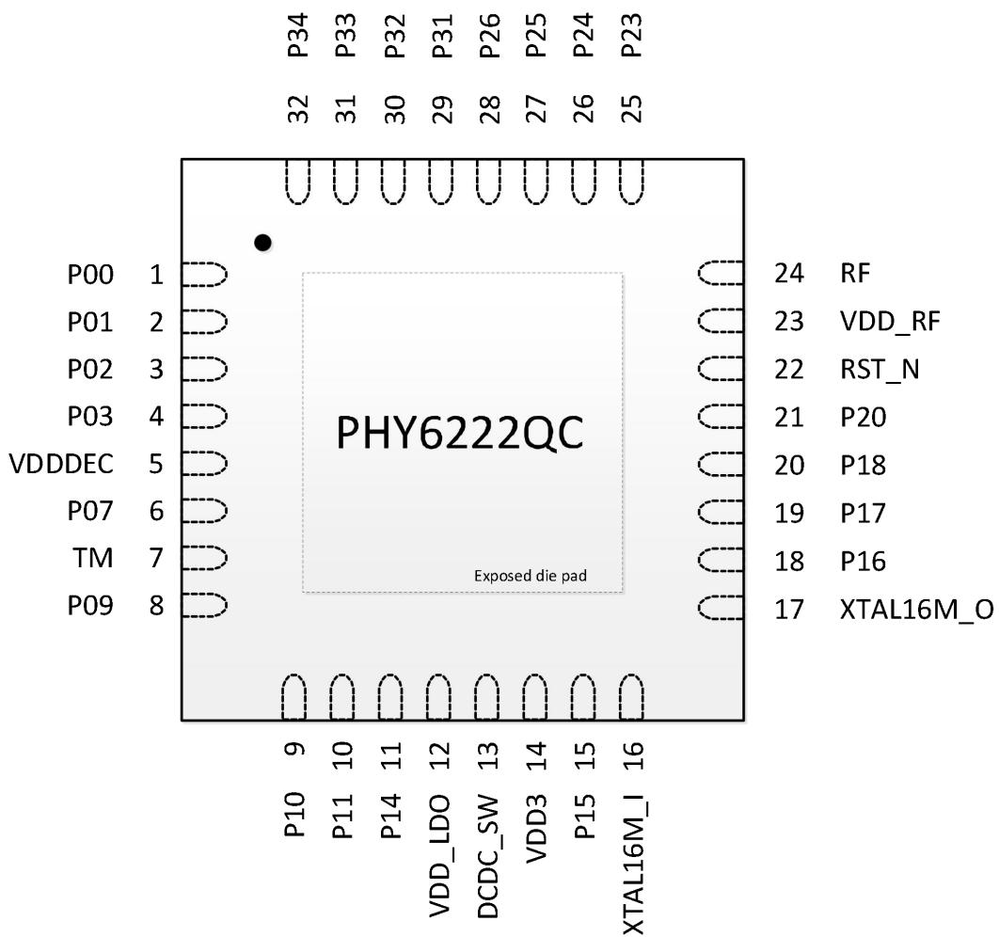


Figure 2: Pin assignment – PHY6222QC QFN32 package


2.2.1.2 Pin Functions


<table><tr><td>Pin</td><td>Pin name</td><td>Description</td></tr><tr><td>1</td><td>P0</td><td>GPIO 0</td></tr><tr><td>2</td><td>P1</td><td>GPIO 1</td></tr><tr><td>3</td><td>P2/SWD_IO</td><td>GPIO 2/SWD debug data inout</td></tr><tr><td>4</td><td>P3/SWD_CLK</td><td>GPIO 3/SWD debug clock</td></tr><tr><td>5</td><td>VDDDEC</td><td>1.2V decoupling pin</td></tr><tr><td>6</td><td>P7</td><td>GPIO 7</td></tr><tr><td>7</td><td>TM</td><td>test mode enable</td></tr><tr><td>8</td><td>P9</td><td>GPIO 9</td></tr><tr><td>9</td><td>P10</td><td>GPIO 10</td></tr><tr><td>10</td><td>P11/AIO_0</td><td>GPIO 11/ADC input 0</td></tr><tr><td>11</td><td>P14/AIO_3</td><td>GPIO 14/ADC input 3</td></tr><tr><td>12</td><td>VDD_LDO</td><td>Internal LDO power supply/DCDC feedback</td></tr><tr><td>13</td><td>DCDC_SW</td><td>DCDC output</td></tr><tr><td>14</td><td>VDD3</td><td>3.3V power supply</td></tr><tr><td>15</td><td>P15/AIO_4</td><td>GPIO 15/ADC input 4/ micbias output</td></tr><tr><td>16</td><td>XTAL16M_I</td><td>16MHz crystal input</td></tr><tr><td>17</td><td>XTAL16M_O</td><td>16MHz crystal output</td></tr><tr><td>18</td><td>P16/XTAL32K_I</td><td>GPIO16/ 32.768KHz crystal input</td></tr><tr><td>19</td><td>P17/XTAL32K_O</td><td>GPIO17/ 32.768KHz crystal output</td></tr><tr><td>20</td><td>P18/AIO_7</td><td>GPIO 18/ADC input 7/ PGA negative input</td></tr><tr><td>21</td><td>P20/AIO_9</td><td>GPIO 20/ADC input 9/ PGA positive input</td></tr><tr><td>22</td><td>RST_N</td><td>reset, active low</td></tr><tr><td>23</td><td>VDD_RF</td><td>power supply decoupling for RF transceiver</td></tr><tr><td>24</td><td>RF</td><td>RF antenna</td></tr><tr><td>25</td><td>P23/AIO_1</td><td>GPIO 23/ADC input 1/micbias reference</td></tr><tr><td>26</td><td>P24/AIO_2</td><td>GPIO 24/ADC input 2</td></tr><tr><td>27</td><td>P25/AIO_8</td><td>GPIO 25/ADC input 8</td></tr><tr><td>28</td><td>P26</td><td>GPIO 26</td></tr><tr><td>29</td><td>P31</td><td>GPIO 31</td></tr><tr><td>30</td><td>P32</td><td>GPIO 32</td></tr><tr><td>31</td><td>P33</td><td>GPIO 33</td></tr><tr><td>32</td><td>P34</td><td>GPIO 34</td></tr></table>


*Note： All gpio support 1M/150kΩ pull up, 150kΩ pull down. 


Table 1: Pin functions of PHY6222QC QFN32 package 

# 2.2.2 PHY6222QH (QFN24)

# 2.2.2.1 Pin Assignment

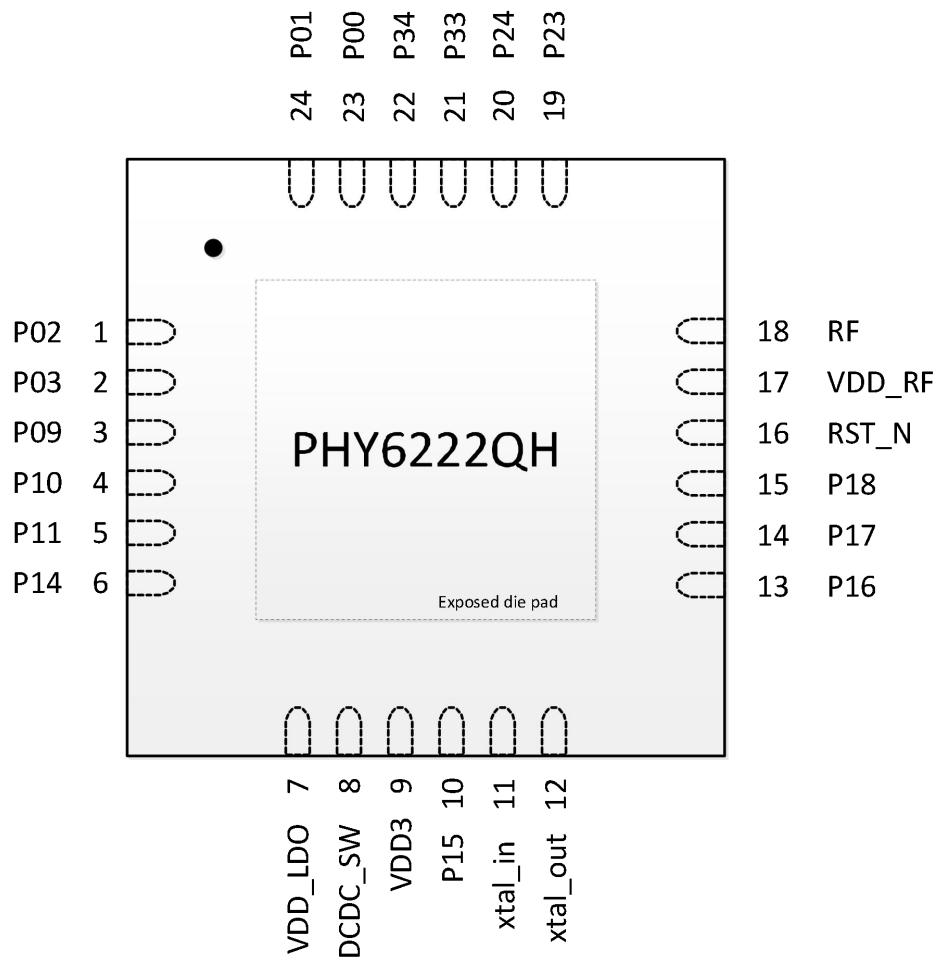


Figure 3: Pin assignment – PHY6222QH QFN24 package


2.2.2.2 Pin Functions


<table><tr><td>Pin</td><td>Pin name</td><td>Description</td></tr><tr><td>1</td><td>P2</td><td>GPIO 2/SWD debug data inout</td></tr><tr><td>2</td><td>P3</td><td>GPIO 3/SWD debug clock</td></tr><tr><td>3</td><td>P9</td><td>GPIO 9</td></tr><tr><td>4</td><td>P10</td><td>GPIO 10</td></tr><tr><td>5</td><td>P11</td><td>GPIO 11/ADC input 0</td></tr><tr><td>6</td><td>P14</td><td>GPIO 14/ADC input 3</td></tr><tr><td>7</td><td>VDD_LDO</td><td>Internal LDO power supply/DCDC feedback</td></tr><tr><td>8</td><td>DCDC_SW</td><td>DCDC output</td></tr><tr><td>9</td><td>VDD3</td><td>3.3V power supply</td></tr><tr><td>10</td><td>P15</td><td>GPIO 15/ADC input 4/ micbias output</td></tr><tr><td>11</td><td>xtal_in</td><td>16MHz crystal input</td></tr><tr><td>12</td><td>xtal_out</td><td>16MHz crystal output</td></tr><tr><td>13</td><td>P16</td><td>GPIO16/ 32.768KHz crystal input</td></tr><tr><td>14</td><td>P17</td><td>GPIO17/ 32.768KHz crystal output</td></tr><tr><td>15</td><td>P18</td><td>GPIO 18/ADC input 7/ PGA negative input</td></tr><tr><td>16</td><td>RST_N</td><td>reset, active low</td></tr><tr><td>17</td><td>VDD_RF</td><td>power supply decoupling for RF transceiver</td></tr><tr><td>18</td><td>RF</td><td>RF antenna</td></tr><tr><td>19</td><td>P23</td><td>GPIO 23/ADC input 1/micbias reference</td></tr><tr><td>20</td><td>P24</td><td>GPIO 24/ADC input 2</td></tr><tr><td>21</td><td>P33</td><td>GPIO 33</td></tr><tr><td>22</td><td>P34</td><td>GPIO 34</td></tr><tr><td>23</td><td>P0</td><td>GPIO 0</td></tr><tr><td>24</td><td>P1</td><td>GPIO 1</td></tr></table>


*Note： All gpio support 1M/150kΩ pull up, 150kΩ pull down. 


Table 2: Pin functions of PHY6222QH QFN24 package 

# 3 System Block

The system block diagram of PHY6222 is shown in Figure 1. 

# 3.1 CPU

The PHY6222 has an ARM Cortex-M0 CPU. The CPU, memories, and all peripherals are connected by AMBA bus fabrics. 

The CPU will play controller role in BLE modem and run all user applications. 

# 3.1.1 ARM M0

The ARM® Cortex™-M0 CPU has a 16-bit instruction set with 32-bit extensions (Thumb-2® technology) that delivers high-density code with a small-memory-footprint. By using a single-cycle 32-bit multiplier, a 3-stage pipeline and a Nested Vector Interrupt Controller (NVIC), the ARM Cortex™-M0 CPU makes program execution simple and highly efficient. 

The main features of ARM® Cortex™-M0 CPU are listed below. 

 Up to 96Mhz ARM Cortex™-M0 processor core. 

o Low gate count and high energy efficient. 

o ARMv6M architecture, Thumb ISA but no ARM ISA. 

o No cache and no TCM. 

o Up to 32 interrupts embedded NVIC. 

o SysTick timer. 

o Sleep/deep sleep mode. 

o Support low power WFI and WFE. 

 Tight integration of system peripherals reduces area and development costs 

 Thumb instruction set combines high code density with 32-bit performance 

 power control optimization of system components 

Integrated sleep modes for low power consumption 

Fast code execution permits slower processor clock or increases sleep mode time 

 Hardware multiplier 

 Deterministic, high-performance interrupt handling for time-critical applications 

 Serial Wire Debug reduces the number of pins required for debugging. 

 APB interface to/from BLE modem. 

 Dynamic and static clock gating to save power. 

 No TRACE. 

Some of these features are shared with the AP subsystem. 

# 3.2 Memory

PHY6222 has total 96KB ROM, 64KB SRAM, 128KB-8MB FLASH and 256bit efuse. The physical address space of these memories is shown in Figure 4. 

Prime Memory Space

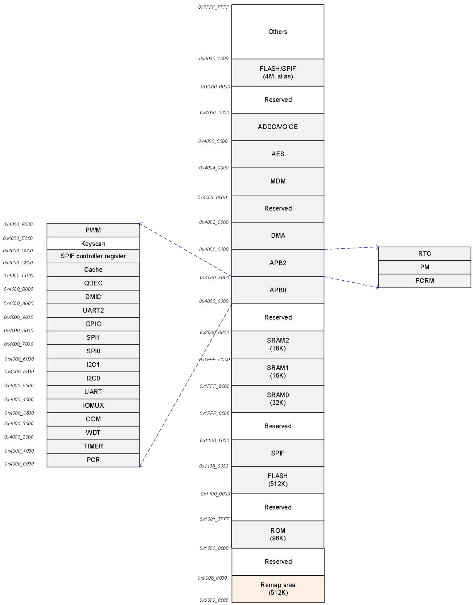


Figure 4: PHY6222 memory space

# 3.2.1 ROM


PHY6222 has 1 ROM.


<table><tr><td></td><td>SIZE</td><td>CONTENT</td></tr><tr><td>ROM</td><td>96KB</td><td>Boot ROM.Protocol stack.Common peripheral drivers.ATE AT command.</td></tr></table>


Table 3: List of ROM


# 3.2.2 SRAM

PHY6222 has 5 SRAM blocks. All 5 SRAM blocks have retention capability, which can be configured individually. Normal operating voltage is 1.2V, and the voltage is adjustable at retention. All SRAM blocks can be used to store program or data. 

<table><tr><td></td><td>SIZE</td><td>CONTENT</td></tr><tr><td>SRAM0</td><td>32KB</td><td></td></tr><tr><td>SRAM1</td><td>16KB</td><td></td></tr><tr><td>SRAM2</td><td>16KB</td><td></td></tr><tr><td>SRAM_BB</td><td>4KB</td><td></td></tr><tr><td>SRAM_cache</td><td>8KB</td><td></td></tr></table>


Table 4: List of SRAMs


# 3.2.3 FLASH

The size of FLASH can be 128KB to 8MB. Supports single-wire, 2-wire, and 4-wire reading, 2 wire reading mode by default. For FLASH greater than 4MB, supporting indirect addressing is needed. 

# 3.2.4 eFuse

PHY6222 integrates 256bits internal nonvolatile one-time programmable EFUSE storage. With a serial interface, 1-bit can be programmed at one clock in program mode and 1-bit can be read at one time in read mode. 

# 3.2.5 Memory Address Mapping

<table><tr><td>Name</td><td>Size (KB)</td><td>Master</td><td>Physical Address</td></tr><tr><td>ROM</td><td>96</td><td>M0</td><td>1000_0000~1001_7FFF</td></tr><tr><td>RAM0</td><td>32</td><td>M0</td><td>1FFF_0000~1FFF_7FFF</td></tr><tr><td>RAM1</td><td>16</td><td>M0</td><td>1FFF_8000~1FFF_BFFF</td></tr><tr><td>RAM2</td><td>16</td><td>M0</td><td>1FFF_C000~1FFF_FFFF</td></tr><tr><td>FLASH</td><td>512</td><td>M0</td><td>1100_0000~1107_FFFF6000_0000~6007_FFFF</td></tr></table>


Table 5: Memory address mapping


# 3.3 Boot and Execution Modes

Only in CP Chip form, the chip enters CP boot mode after power on. ROM1 is then aliased to the 0x0 address and the chip program starts from ROM1. 


Boot


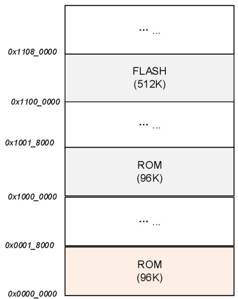


Figure 5: PHY6222 boot mode


# 3.3.1 Boot Loader

The boot loader in the ROM has the basic structure as shown below. The content in the FLASH should be specifically defined to allow boot loader to identify whether the FLASH content is valid, as shown in the example below. If the FLASH is valid, the ROM boot loader will put the chip in the normal mode and start normal program execution. If the FLASH is not valid, the boot loader will enter FLASH programming mode. 

<table><tr><td>Address</td><td>Variable</td><td>Content</td></tr><tr><td>0</td><td>PRODUCT_MODE</td><td>Identify the chip mode</td></tr><tr><td>4</td><td>CODE_BASE</td><td>The base address of the code</td></tr><tr><td>8</td><td>CODE_LEN</td><td>The length of the code</td></tr><tr><td>C</td><td>BOOT_MODE</td><td>Identify mirror or FLASH mode</td></tr></table>


Table 6: Flash content example


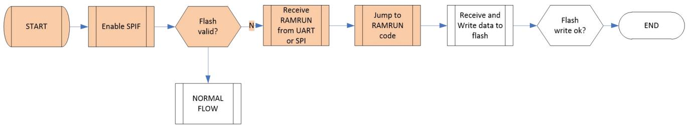


Figure 6: Bootloader flow


# 3.4 Power, Clock and Reset (PCR)

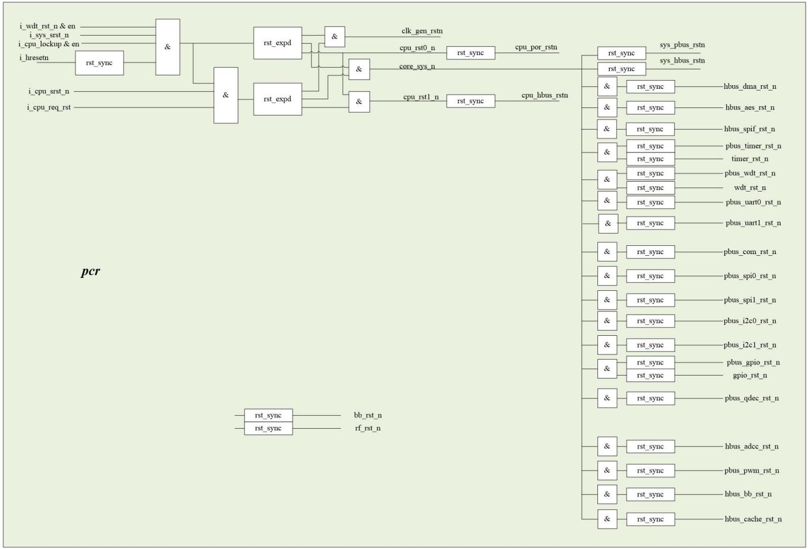


Figure 7: PHY6222 power, clock and reset


# 3.5 Power Management (POWER)

The power management system is highly flexible with functional blocks such as the CPU, radio transceiver, and peripherals saving separate power state control in addition to the System Sleep mode and OFF modes. When in System Normal mode, all functional blocks will independently be turned on depending on needed application functionality. 

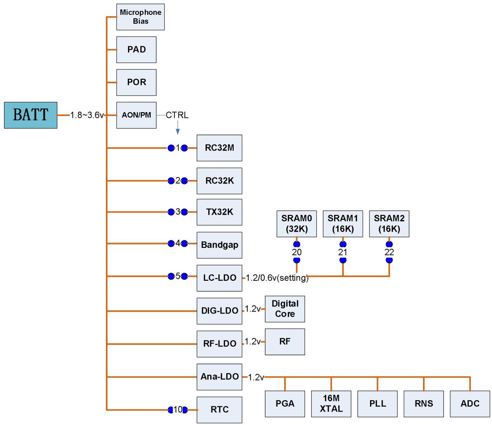


Figure 8: Power system


The following diagram is Normal, Sleep and Off mode. Switches are optional depending on user’s request. 

<table><tr><td>Switch</td><td>Normal</td><td>Sleep</td><td>Off</td></tr><tr><td>1RC32M</td><td>On</td><td>Off</td><td>Off</td></tr><tr><td>2RC32K</td><td>On</td><td>Optional</td><td>Off</td></tr><tr><td>3XT32K</td><td>On</td><td>Optional</td><td>Off</td></tr><tr><td>4bandgap</td><td>On</td><td>Off</td><td>Off</td></tr><tr><td>5LC-LDO</td><td>On</td><td>On</td><td>Off</td></tr><tr><td>10RTC</td><td>On</td><td>Optional</td><td>Off</td></tr><tr><td>20SRAM-32K</td><td>1.2v</td><td>0.6v</td><td>0</td></tr><tr><td>21SRAM-16K</td><td>1.2v</td><td>0.6v</td><td>0</td></tr><tr><td>22SRAM-16K</td><td>1.2v</td><td>0.6v</td><td>0</td></tr></table>


Table 7: Power Switches of different power modes


# 3.6 Low Power Features

# 3.6.1 Operation and Sleep States

# 3.6.1.1 Normal State

# 3.6.1.2 Clock Gate State

The CPU executes WFI/WFE to enter clock gate state. After wake-up from clock-gate state, the CPU continues to execute the program from where it stopped. The wake-up sources includes interrupts and events. The wake-up sources are configured by the software according to applications. 

# 3.6.1.3 System Sleep State

The wake-up sources include: 

IO 

 RTC 

RESET 

 UVLO reset 

# 3.6.1.4 System Off State

The wake-up sources include： 

IOs 

RESET 

 UVLO reset 

# 3.6.1.5 UVLO

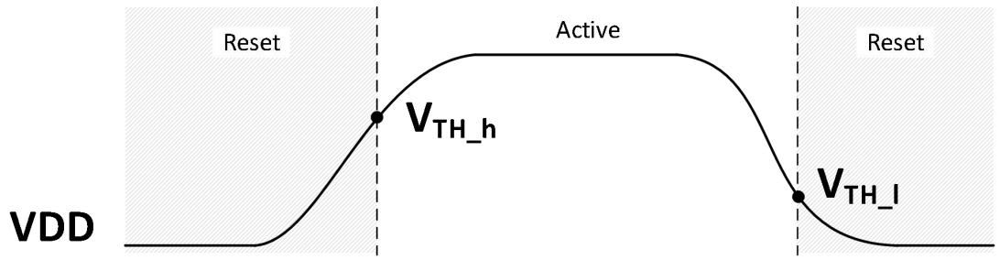


Figure 9: UVLO reset

VDD > VTH_h, release reset; VDD < VTH_l, enter reset. 

<table><tr><td>VDD</td><td>Min.</td><td>TYP</td><td>Max.</td><td>Unit</td></tr><tr><td><eq>V_{TH\_h}</eq></td><td>1.7</td><td>1.74</td><td>1.78</td><td>V</td></tr><tr><td><eq>V_{TH\_I}</eq></td><td>1.63</td><td>1.66</td><td>1.69</td><td>V</td></tr></table>


Table 8: UVLO


# 3.6.2 State Transition

# 3.6.2.1 Entering Clock Gate State and Wake-up

CPU executes WFI/WFE. 

# 3.6.2.2 Entering Sleep/off States and Wake-up

The PM registers identify whether the CPU is in mirror mode or FLASH mode before sleep or off, and record the remap and vectors. The CPU configures the corresponding PM registers to put the chip into sleep mode. After wake-up, the chip enters boot mode to execute boot code in the ROM. The ROM code checks the mode before sleep/off and the remap information, perform corresponding configurations, and starts to execute the program. 

# 3.7 Interrupts

<table><tr><td>Interrupt Name</td><td>M0 Interrupt Number</td></tr><tr><td></td><td>0</td></tr><tr><td>M0(coretime irq)</td><td>1</td></tr><tr><td></td><td>2</td></tr><tr><td></td><td>3</td></tr><tr><td>bb_irq</td><td>4</td></tr><tr><td>kscan_irq</td><td>5</td></tr><tr><td>rtc_irq</td><td>6</td></tr><tr><td>cpcom_ap_ipc_irq</td><td>7</td></tr><tr><td>apcom_ap_ipc_irq</td><td>8</td></tr><tr><td></td><td>9</td></tr><tr><td>wdt_irq</td><td>10</td></tr><tr><td>uart0_irq</td><td>11</td></tr><tr><td>i2c0_irq</td><td>12</td></tr><tr><td>i2c1_irq</td><td>13</td></tr><tr><td>spi0_irq</td><td>14</td></tr><tr><td>spi1_irq</td><td>15</td></tr><tr><td>gpio_irq</td><td>16</td></tr><tr><td>uart1_irq</td><td>17</td></tr><tr><td>spif_irq</td><td>18</td></tr><tr><td>dmac_intr</td><td>19</td></tr><tr><td>timer_irq[1]</td><td>20</td></tr><tr><td>timer_irq[2]</td><td>21</td></tr><tr><td>timer_irq[3]</td><td>22</td></tr><tr><td>timer_irq[4]</td><td>23</td></tr><tr><td>timer_irq[5]</td><td>24</td></tr><tr><td>timer_irq[6]</td><td>25</td></tr><tr><td></td><td>26</td></tr><tr><td></td><td>27</td></tr><tr><td>aes_irq</td><td>28</td></tr><tr><td>adcc_irq</td><td>29</td></tr><tr><td>qdec_irq</td><td>30</td></tr><tr><td></td><td>31</td></tr></table>

Table 9: Interrupts 

# 3.8 Clock Management

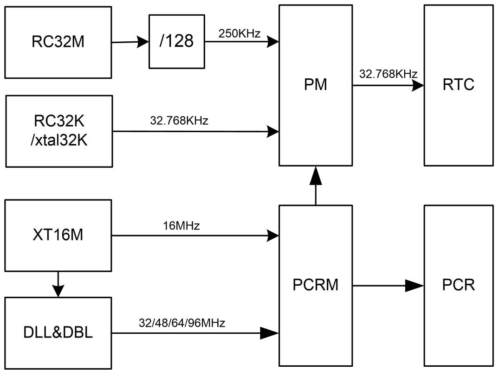


Figure 10: Clock management


There are two crystal clock sources: 16MHz crystal oscillator (XT16M) and 32.768kHz crystal oscillator (XT32k), of which the 32.768k crystal oscillator is optional. There are also two on chip RC oscillators: 32MHz RC oscillator (RC32M) and 32kHz RC oscillator (RC32k), both of which can be calibrated with respect to 16MHz crystal oscillator. If 32.768kHz crystal is not installed, RC32k oscillator would be periodically calibrated and used for RTC. At initial power up or wake up before XT16M oscillator starts up, RC32M is used as the main clock. An on-chip DLL generates higher frequency clocks such as 32/48/64/96MHz. 

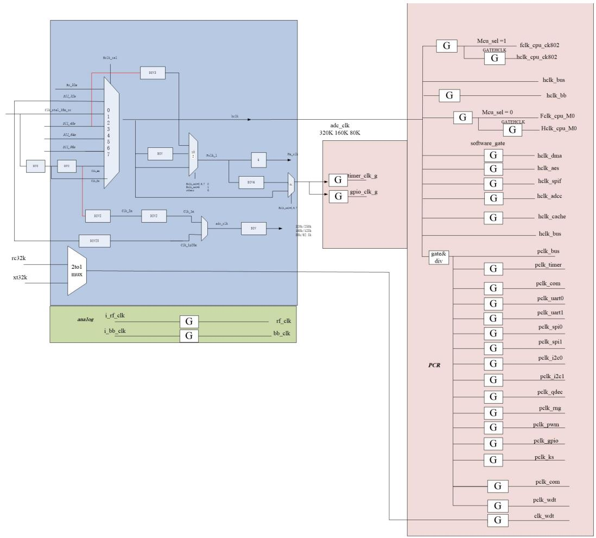


Figure 11: Clock structure diagram


# 3.9 IOMUX

The IOMUX provides a flexible I/O configuration, as the ports of most of the peripherals can be configured and mapped to any of the physical I/O pads (I/O at die boundary). These peripheral modules include I2C 0-1, UART0-1, PWM 0-5, SPI 0-1, Quadrature Decoder etc. However for other specific purpose peripherals, their IOs mappings are fixed when they are enabled. These specific purpose peripherals include JTAG, analog_ios, GPIOs and key scan. 

Figure 12 below shows the IOMUX functional diagram. 

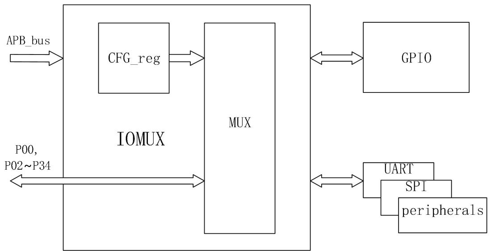


Figure 12: IOMUX structure diagram


There are 34 configurable pads which are from P00 to P07 and from P09 to P34. P08 pad is assigned for TM pin which is a test mode pin. The table blow shows the mapping of the peripheral IOs that can be mapped through IOMUX. These include I2C 0-1, UART 0-1, PWM 0-5, SPI 0-1, Quadrature Decoder, 1.28MHz clock and dmic_out. 

On the other hand, there are also special purpose peripherals, whose IOs are fixed to certain physical pads, when these peripheral functions are enabled. These special purpose peripherals include: JTAG, analog I/Os (ADC inputs), GPIO, and key scan. When they are enabled, their IOs are mapped to physical pads according to the following table. 

<table><tr><td>#</td><td>QFN32</td><td></td><td></td><td>Name</td></tr><tr><td>0</td><td>GPIO_P00</td><td>GPIO</td><td></td><td>mk_in[0]</td></tr><tr><td>1</td><td>GPIO_P01</td><td>GPIO</td><td></td><td>mk_out[0]</td></tr><tr><td>2</td><td>GPIO_P02</td><td>SDW_IO</td><td></td><td>mk_in[1]</td></tr><tr><td>3</td><td>GPIO_P03</td><td>SDW_CLK</td><td></td><td>mk_out[1]</td></tr><tr><td>4</td><td>GPIO_P07</td><td>GPIO</td><td></td><td>mk_in[10]</td></tr><tr><td>5</td><td>TEST_MODE</td><td></td><td></td><td></td></tr><tr><td>6</td><td>GPIO_P09</td><td>GPIO</td><td></td><td>mk_out[4]</td></tr><tr><td>7</td><td>GPIO_P10</td><td>GPIO</td><td></td><td>mk_in[4]</td></tr><tr><td>8</td><td>GPIO_P11</td><td>GPIO</td><td>analog_io[0]</td><td>mk_out[11]</td></tr><tr><td>9</td><td>GPIO_P14</td><td>GPIO</td><td>analog_io[3]</td><td>mk_out[2]</td></tr><tr><td>10</td><td>GPIO_P15</td><td>GPIO</td><td>analog_io[4]</td><td>mk_in[2]</td></tr><tr><td>11</td><td>GPIO_P16</td><td>XTALI(ANA)</td><td></td><td>mk_out[10]</td></tr><tr><td>12</td><td>GPIO_P17</td><td>XTALO(ANA)</td><td></td><td>mk_out[9]</td></tr><tr><td>13</td><td>GPIO_P18</td><td>GPIO</td><td>analog_io[7]</td><td>mk_in[5]</td></tr><tr><td>14</td><td>GPIO_P20</td><td>GPIO</td><td>analog_io[9]</td><td>mk_out[5]</td></tr><tr><td>15</td><td>GPIO_P23</td><td>GPIO</td><td>analog_io[1]</td><td>mk_in[6]</td></tr><tr><td>16</td><td>GPIO_P24</td><td>GPIO</td><td>analog_io[2]</td><td>mk_out[3]</td></tr><tr><td>17</td><td>GPIO_P25</td><td>GPIO</td><td>analog_io[8]</td><td>mk_in[3]</td></tr><tr><td>18</td><td>GPIO_P26</td><td>GPIO</td><td></td><td>mk_out[8]</td></tr><tr><td>19</td><td>GPIO_P27</td><td>GPIO</td><td></td><td>mk_in[9]</td></tr><tr><td>20</td><td>GPIO_P31</td><td>GPIO</td><td></td><td>mk_out[7]</td></tr><tr><td>21</td><td>GPIO_P32</td><td>GPIO</td><td></td><td>mk_in[7]</td></tr><tr><td>22</td><td>GPIO_P33</td><td>GPIO</td><td></td><td>mk_out[6]</td></tr><tr><td>23</td><td>GPIO_P34</td><td>GPIO</td><td></td><td>mk_in[8]</td></tr></table>

Table 10: Peripheral IO mapped through IOMUX (special purpose) 

In the IOMUX table above, the first column is the IO pad mapping in default mode, when no IOMUX function is selected and no special purpose peripherals such as analog IO, GPIO<0:3>, key scan, are enabled. In this mode, pin<0:3> are used for JTAG. 

When analog IOs are enabled, pins<11:15>, <18:20> are connected to internal analog IOs. More specifically, analog_io<0:4><9> are connected to ADC inputs, analog_io<7,8> are connected to PGA inputs. 

In JTAG mode, data output for JTAG test mode is mapped to P00; data input for JTAG test mode is mapped to P01; mode control input for JTAG test mode is mapped to P02; clock input for JTAG test mode is mapped to P03. 

# 3.10 GPIO

The General Purpose I/Os are a type of peripheral that can be mapped to physical I/O pads and programmed by software. The flexible GPIO are organized as PORT A. PortA has bi-direction 18 bit lines, e.g., GPIO_PORT A[22:0]. With default setting, physical pads: P00-P34 are connected to PortA. When all GPIOs are enabled, as described in the IOMUX table in IOMUX section. 

All PortA pins can be configured as bi-directional serial interface, by selecting as input or output direction, and their corresponding data can be either read from or written to registers. All PortA and pins support wake-up and debounce function, but only 18 PortA pins support interrupt. 

Each GPIO pins can be pulled up to VDD3 or pulled down to ground by adding pull up or pull down resistors to have default functions/states. 

For more detailed info, please refer to “PHY62xx GPIO Application Notes”, in software SDK document folder. 

<table><tr><td>#</td><td>QFN32</td><td>Default MODE</td><td>Default IN_OUT</td><td>IRQ</td><td>Wakeup</td><td>ANA_IO</td></tr><tr><td>0</td><td>GPIO_P00</td><td>GPIO</td><td>IN</td><td>√</td><td>√</td><td></td></tr><tr><td>1</td><td>GPIO_P01</td><td>GPIO</td><td>IN</td><td>√</td><td>√</td><td></td></tr><tr><td>2</td><td>GPIO_P02</td><td>SWD_IO</td><td>OUT</td><td>√</td><td>√</td><td></td></tr><tr><td>3</td><td>GPIO_P03</td><td>SWD_CLK</td><td>IN</td><td>√</td><td>√</td><td></td></tr><tr><td>4</td><td>GPIO_P07</td><td>GPIO</td><td>IN</td><td>√</td><td>√</td><td></td></tr><tr><td>5</td><td>TEST_MODE</td><td></td><td></td><td></td><td></td><td></td></tr><tr><td>6</td><td>GPIO_P09</td><td>GPIO</td><td>IN</td><td>√</td><td>√</td><td></td></tr><tr><td>7</td><td>GPIO_P10</td><td>GPIO</td><td>IN</td><td>√</td><td>√</td><td></td></tr><tr><td>8</td><td>GPIO_P11</td><td>GPIO</td><td>IN</td><td>√</td><td>√</td><td></td></tr><tr><td>9</td><td>GPIO_P14</td><td>GPIO</td><td>IN</td><td>√</td><td>√</td><td>ADC_CH2P_P14</td></tr><tr><td>10</td><td>GPIO_P15</td><td>GPIO</td><td>IN</td><td>√</td><td>√</td><td>ADC_CH3N_P15</td></tr><tr><td>11</td><td>GPIO_P16</td><td>XTALI(ANA)</td><td>ANA</td><td></td><td>√</td><td></td></tr><tr><td>12</td><td>GPIO_P17</td><td>XTALO(ANA)</td><td>ANA</td><td></td><td>√</td><td></td></tr><tr><td>13</td><td>GPIO_P18</td><td>GPIO</td><td>IN</td><td>√</td><td>√</td><td>ADC_CHOP_P18</td></tr><tr><td>14</td><td>GPIO_P20</td><td>GPIO</td><td>IN</td><td>√</td><td>√</td><td>ADC_CH3P_P20</td></tr><tr><td>15</td><td>GPIO_P23</td><td>GPIO</td><td>IN</td><td>√</td><td>√</td><td>ADC_CH1P_P23</td></tr><tr><td>16</td><td>GPIO_P24</td><td>GPIO</td><td>IN</td><td>√</td><td>√</td><td>ADC_CH2N_P24</td></tr><tr><td>17</td><td>GPIO_P25</td><td>GPIO</td><td>IN</td><td>√</td><td>√</td><td>ADC_CHON_P25</td></tr><tr><td>18</td><td>GPIO_P26</td><td>GPIO</td><td>IN</td><td>√</td><td>√</td><td></td></tr><tr><td>19</td><td>GPIO_P27</td><td>GPIO</td><td>IN</td><td>√</td><td>√</td><td></td></tr><tr><td>20</td><td>GPIO_P31</td><td>GPIO</td><td>IN</td><td>√</td><td>√</td><td></td></tr></table>

Table 11: PHY6222 GPIO Application Notes 

# 3.10.1 DC Characteristics


${ \mathsf { T A } } { = } 2 5 ^ { \circ } { \mathsf { C } } ,$ VDD=3 V


<table><tr><td>PARAMETER</td><td>TEST CONDITIONS</td><td>Min.</td><td>TYP</td><td>Max.</td><td>Unit</td></tr><tr><td>Logic-0 input voltage</td><td></td><td></td><td></td><td>0.5</td><td>V</td></tr><tr><td>Logic-1 input voltage</td><td></td><td>2.4</td><td></td><td></td><td>V</td></tr><tr><td>Logic-0 input current</td><td>Input equals 0 V</td><td>-50</td><td></td><td>50</td><td>nA</td></tr><tr><td>Logic-1 input current</td><td>Input equals VDD</td><td>-50</td><td></td><td>50</td><td>nA</td></tr><tr><td>Logic-0 output voltage, 10-mA pins</td><td>Output load 10 mA</td><td></td><td></td><td>0.5</td><td>V</td></tr><tr><td>Logic-1 output voltage, 10-mA pins</td><td>Output load 10 mA</td><td>2.5</td><td></td><td></td><td>V</td></tr></table>


Table 12: DC Characteristics


# 4 Peripheral Blocks

# 4.1 2.4GHz Radio

The 2.4 GHz RF transceiver is designed to operate in the worldwide ISM frequency band at 2.4 to 2.4835 GHz. Radio modulation modes and configurable packet structure make the transceiver interoperable with Bluetooth LE 5.2 protocol implementations. 

General modulation format 

FSK (configurable modulation index) with configurable Gaussian Filter Shaping 

OQPSK with half-sine shaping 

On-air data rates 

125kbps/250kbps/500kbps/1Mbps/2Mbps 

Transmitter with programmable output power of -20dBm to +10dBm, in 3dB steps 

RSSI function (1 dB resolution, ± 2 dB accuracy) 

Receiver sensitivity 

-105dBm@125Kbps GFSK 

-100dBm@500Kbps GFSK 

-99dBm@1Mbps BLE 

-96dBm@2Mbps BLE 

Embedded RF balun 

Integrated frac-N synthesizer with phase modulation 

# 4.2 Timer/Counters (TIMER)

The implementation can include a 32-bit SysTick system timer, that extends the functionality of both the processor and the NVIC. When present, the NVIC part of the extension provides: 

A 32-bit system timer (SysTick) 

Additional configurable priority SysTick interrupt. 

General purpose timers are included in the design. With the input clock running at 4Mhz. 

# 4.3 Real Time Counter (RTC)

The Real Time Counter (RTC) module provides a generic, low power timer on the low-frequency clock source (LFCLK). The RTC features a 24 bit COUNTER, 12 bit (1/X) prescaler, capture/compare registers, and a tick event generator for low power, tickless RTOS implementation. 

# 4.4 AES-ECB Encryption (ECB)

The ECB encryption block supports 128 bit AES encryption. It can be used for a range of cryptographic functions like hash generation, digital signatures, and keystream generation for data encryption/decryption. 

# 4.5 Watchdog Timer (WDT)

A count down watchdog timer using the low-frequency clock source (LFCLK) offers configurable and robust protection against application lock-up. The watchdog can be paused during long CPU sleep periods for low power applications and when the debugger has halted the CPU. 

# 4.6 SPI (SPI0, SPI1 Two Independent Instances)

The SPI interface supports 3 serial synchronous protocols which are SPI, SSP and Microwire serial protocols. SPI wrapper contains one SPI master and one SPI slave. They are logically exclusive. Only one block is alive at a time. The operation mode for master mode and slave mode is controlled by PERI_MASTER_SELECT Register in COM block. 

<table><tr><td>bit</td><td>Reset value</td><td>Definition</td></tr><tr><td>1</td><td>0</td><td>SPI1 is master mode when set</td></tr><tr><td>0</td><td>0</td><td>SPI0 is master mode when set</td></tr></table>


Table 13: PERI_MASTER_SELECT Register bit definition (base address = 0x4000_302C)


# 4.7 I2C (I2c0, I2c1 Two Independent Instances)

This I2C block support 100Khz, and 400Khz modes. It also supports 7-bit address and 10-bit address. It has built-in configurable spike suppression function for both lines. 

# 4.8 UART (UART0, UART1 Two Independent Instances)

The Universal Asynchronous Receiver/Transmitter offers fast, full-duplex, asynchronous serial communication with built-in flow control (CTS, RTS) support in HW up to 1Mbps baud. Parity checking and generation for the 9th data bit are supported. 

The GPIOs used for each UART interface line can be chosen from any GPIO on the device and are independently configurable. This enables great flexibility in device pin out and enables efficient use of board space and signal routing. 

# 4.9 DMIC/AMIC Data Path

The voice in interface supports one analog MIC (SAR-ADC) and two digital MIC (L+R), different output sample rate (64KHz, 32KHz, 16KHz and 8KHz), and different voice compress algorithm. For the Digital MIC, PDM signal is sampled at 1.28MHz(4x320KHz). L channel is sampled at raising edge, R channel is sampled at falling edge. For PCM-LOG and CVDS, output data rate is 64Kbps (8KHz x 8bit). 

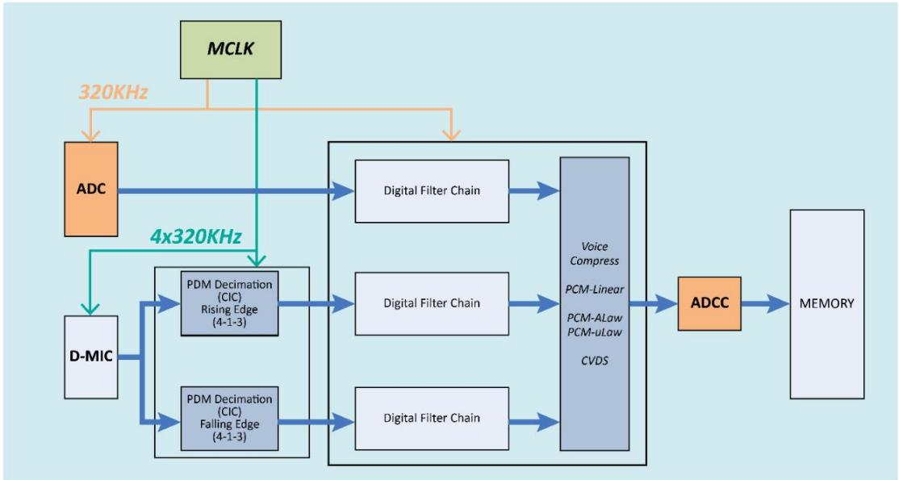


Figure 13: Block Diagram of Voice In Interface


Base address: 0x4005_0000


<table><tr><td>OFFSET</td><td>TYPE</td><td>RESET</td><td>NAME</td><td>DESCRIPTION</td></tr><tr><td>0x00</td><td></td><td></td><td colspan="2">ADCC voice enable</td></tr><tr><td>[31:1]</td><td>—</td><td>31'b0</td><td>reserved</td><td></td></tr><tr><td>[0]</td><td>RW</td><td>1'b0</td><td>Enable</td><td>Setting this bit to “1” will enable voice core work</td></tr><tr><td>0x08</td><td></td><td></td><td colspan="2">ADCC reserved reg</td></tr><tr><td>[31:0]</td><td>—</td><td>32'b0</td><td>reserved</td><td></td></tr><tr><td>0x0C</td><td></td><td></td><td colspan="2">ADCC voice control 1</td></tr><tr><td>[31:23]</td><td>—</td><td>9'd0</td><td>reserved</td><td></td></tr><tr><td>[22:16]</td><td>RW</td><td>7'd40</td><td>gain_ctrl</td><td>Vocie Process Gain control,+-20dB, Step is 0.5dB.Voice_gain = (gain_ctrl-40)*0.5dBgain_ctrl with in[0 80]</td></tr><tr><td>[15:14]</td><td>—</td><td>2'd0</td><td>reserved</td><td></td></tr><tr><td>[13:12]</td><td>RW</td><td>2'd2</td><td>encode_mode</td><td>Voice compress encode mode sel:0:pcm a-law1:pcm u-law2:cvsd3:bypass</td></tr><tr><td>[11:10]</td><td>—</td><td>2'd0</td><td>reserved</td><td></td></tr><tr><td>[9:8]</td><td>RW</td><td>2'd0</td><td>voice_sel</td><td>Voice Process Output Rate Sel:0:64Ksps1:32Ksps2:16Ksps3:8Ksps</td></tr><tr><td>[7]</td><td>RW</td><td>1'b0</td><td>fir filter bandwidth</td><td>1:4K,0:8K</td></tr><tr><td>[6]</td><td>RW</td><td>1'b0</td><td>pcm_au_sel</td><td>pcm encode, 1:a-law 0: u-law</td></tr><tr><td>[5]</td><td>RW</td><td>1'b0</td><td>lr_sel</td><td></td></tr><tr><td>[4]</td><td>—</td><td>1'b0</td><td>reserved</td><td></td></tr><tr><td>[3:2]</td><td>RW</td><td>2'd1</td><td>notch_bw</td><td>Dc Notch Filter BW</td></tr><tr><td colspan="4"></td><td>0:bypass the DC Notch filterOther: one order high pass iir filter1:a(n)+a(n-1)*(1-1/2^14)2:a(n)+a(n-1)*(1-2/2^14)3:a(n)+a(n-1)*(1-3/2^14)</td></tr><tr><td>[1]</td><td>RW</td><td>1'b0</td><td>plry_sel</td><td>Adc input polarity selection0:voiceIn-20481:2048-voiceIn</td></tr><tr><td>[0]</td><td>RW</td><td>1'b0</td><td>mic_sel</td><td>DMIC and AMIC selection:0:AMIC1:DMIC</td></tr><tr><td colspan="5">0x10 ADCC voice control 2</td></tr><tr><td>[31]</td><td>—</td><td>1'd0</td><td>Reserved</td><td></td></tr><tr><td>[30:20]</td><td>RW</td><td>11'd64</td><td>gain_max</td><td>Max Gain in auto mute process</td></tr><tr><td>[19:16]</td><td>—</td><td>4'd6</td><td>gain_maxbw</td><td>Max Gain BW in auto mute process</td></tr><tr><td>[15:14]</td><td>RW</td><td>2'd0</td><td>reserved</td><td></td></tr><tr><td>[13:8]</td><td>RW</td><td>6'd9</td><td>amut_gdut</td><td>Auto mute adjust duration</td></tr><tr><td>[7:4]</td><td>RW</td><td>4'd0</td><td>amut_gst2</td><td>Auto mute gain increasingstep</td></tr><tr><td>[3:0]</td><td>RW</td><td>4'd1</td><td>amut_gst1</td><td>Auto mute gain increasingstep</td></tr><tr><td colspan="5">0x14 ADCC voice control 3</td></tr><tr><td>[31]</td><td>—</td><td>1'b0</td><td>Reserved</td><td></td></tr><tr><td>[30:20]</td><td>RW</td><td>11'd55</td><td>amut_lvl2</td><td>Auto Mute Stop Level</td></tr><tr><td>[19]</td><td>—</td><td>1'b0</td><td>reserved</td><td></td></tr><tr><td>[18:8]</td><td>RW</td><td>11'd10</td><td>amut_lvl1</td><td>Auto Mute Start Level</td></tr><tr><td>[7:1]</td><td>—</td><td>7'b0</td><td>reserved</td><td></td></tr><tr><td>[0]</td><td>RW</td><td>1'b0</td><td>amut_byps</td><td>Bypass automate function</td></tr><tr><td colspan="5">0x18 ADCC voice control 4</td></tr><tr><td>[31:16]</td><td>—</td><td>16'd0</td><td>Reserved</td><td></td></tr><tr><td>[15:8]</td><td>RW</td><td>8'd48</td><td>amut_alvl</td><td>Adaptive Mute Level control:0: disable adaptive Mute levelOther:Mute level1 = adpPower+amut_lvl1Mute level2 = adpPower+amut_lvl2adpPower is estimated over(amut_alv1&lt;</td></tr><tr><td>[7]</td><td>—</td><td>1'd0</td><td>reserved</td><td></td></tr><tr><td>[6:4]</td><td>RW</td><td>3'd3</td><td>amut_beta</td><td>Voice Level Estimation filter bandwidth(one order low pss iir filter):</td></tr><tr><td>[3:0]</td><td>RW</td><td>4'd10</td><td>amut_winl</td><td>Voice Level estimation window length:samples = 1&lt;</td></tr></table>

Table 14: ADCC Voice 

# 4.9.1 Filter Chain Design

For D-MIC input, PDM Decimation (CIC) will convert the 1-bit PDM signal to 12 bit PCM signal. And the sample rate will be converted from 1.28MHz to 320KHz. The output data of the PDM Decimation 

will be connected to the Digital Filter chain. 

For the A-MIC input, SAR-ADC will convert the signal to 12bit 320KHz digital samples. The Digital Filter chain will process the data same as the D-MIC path. 

The Output sample rate of the Digital filter chain is programmable. 64KHz, 32KHz, 16KHz, 8KHz. The maximum value of the sample’s bit-width is 16bit. 

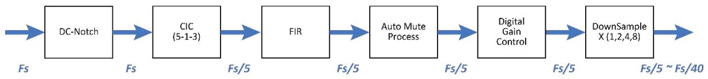


Figure 14: Digital Filter Chain


# 4.9.2 Auto Mute Process

Signal Level Estimate will check the input signal level with configurable window size. Mute threshold can be updated according to the signal level estimation or being configured by the register. There are two thresholds, one for MUTE_ON, another for MUTE_OFF. Gain step of MUTE_ON and MUTE_OFF can be configured individually. 

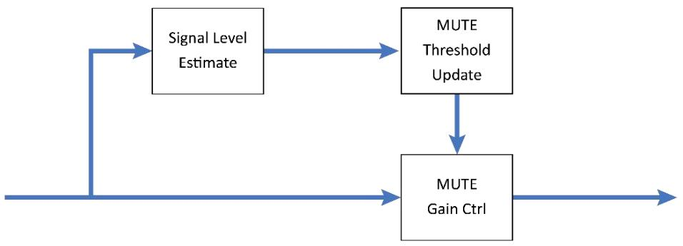


Figure 15: Auto Mute Process


# 4.9.3 Digital Gain Control

Digital gain is implemented by one Look up table. The gain error has been controled within 0.05dB. 

# 4.9.4 Voice Compression

PCM-LOG support u-Law and a-Law. According to the ITU-G711 standard. The input data is 13~14bit @ 8KHz. The output data is 8bit @ 8KHz, 64Kbps. Also, it support 64Kbps CVSD according to the BT standard. Its Input is 16bit @64KHz, and its output is 1bit @ 64KHz. PCM-Linear is for the raw data without compression. 

# 4.10 Pulse Width Modulation (PWM)

PHY62xx supports 6 channels of Pulse Width Modulation (PWM) outputs. PWM outputs generate waveforms with variable duty cycle or pulse width programmed by registers. And each of the 6 PWM outputs can be individually programmed. Their duty cycles are controlled by programming individual counters associated with each channel. 

The master clock is 16MHz. For each PWM outputs, first there is a prescaler (pre-divider) with division ratio of 2 to 128 (only 2^N division ratios are supported), followed by another 16bit counter with programmable max count, denoted as top_count. When the 16bit counter counts from 0 to top_count, it resets back to 0. So the frequency of the PWM is given by: 

$$
\text { Freq\_PWM } = 1 6 \text { MHz } / (\text { N\_prescaler } * \text { N\_top\_count });
$$

A threshold counter number can be programmed, when the 16bit counter reaches the threshold, PWM output toggles. So the duty cycle is: 

$$
\text { Duty\_cycle\_PWM } = \text { N\_threshold } / \text { N\_top\_count };
$$

The polarity of the PWM can also be programmed, which indicates output 1 or 0 when counter is below/above the threshold. A PWM waveform vs counter values are illustrated in the following Figure 16, where the polarity is positive. Also in this case the counter ramps up and then resets, we call it “up mode”. 

There is also a “up and down mode”, where the counter ramps up to count_top and then ramps down, instead of reset. 

As discussed above, the key register bits for one PWM channel are: 16bit top_count, 16bit threshold count, 3bit prescaler count, PWM polarity, PWM mode (up or up/down), PWM enable, and PWM load enable (load new settings). All 6 PWM channels can be individually programmed by registers with addresses from 0x4000_E004 to 0x4000_E044. In addition, one should enable registers 0x4000_E000<0><4> to allow all PWM channels can be programmed. For details please refer to documents of PHY62xx register tables. 

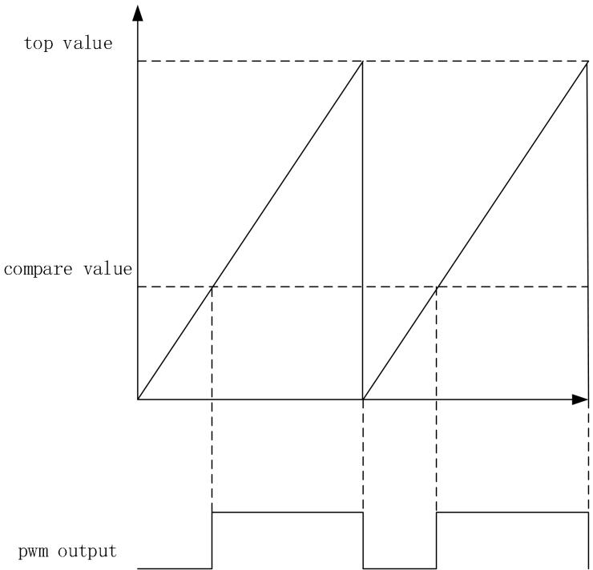


Figure 16: PWM operation

# 4.11 Quadrature Decoder (QDEC)

The quadrature decoder provides buffered decoding of quadrature-encoded sensor signals with input debounce filters. It is suitable for mechanical and optical sensors. The sample period and accumulation are configurable to match application requirements. The quadrature decoder has three-axis capability and index channel support. It can be programmed as 4x/2x/1x count mode. 

# 4.12 Key Scan (KSCAN)

Keyscan supports key matrix with upto 16 rows by 18 columns. Each individual rows or columns can be enabled or disabled through register settings. GPIO pins can be configured to be used for key scan. A few key scan Parameters can be set through registers, including polarity (low or high indicating key pressed); support multi-key-press or only single-key-press; de-bounce time (the time duration a key press is deemed valid) from 0 to 128mS with 255us step. 

A valid key press can trigger an interrupt when keyscan interrupt is enabled. After a keyscan interrupt is serviced, writing 1 to the interrupt state register bit can clear the state bit. 

The keyscan has a manual mode and an auto mode. For manual mode, when a keyscan interrupt is received, it is upo the MCU/software to scan the keyscan output pins and check the input pins, to determine which keys have been pressed. Manual mode is relatively slow and need CPU to process. On the contrary, in automode keyscan will automatically scan the output/input pins, and store the row/column info corresponding to the key pressed into read only registers, then trigger an interrupt for software to retrieve key press information. 

# 4.13 Analog to Digital Converter (ADC) with Programmable Gain Amplifier (PGA)

The 12bit SAR ADC has total 10 inputs. Among them, there are two for PGA inputs, and two differential inputs for the on-chip temperature sensor. The other six inputs can be programmed to 4 pair differential inputs or six single-ended inputs. There is a manual mode with which the ADC can be configured to convert a specific input in single-ended or differential and with a specific ADC clock rate. There is also an auto sweep mode, namely all enabled input channels can be swept automatically in order by the ADC and the converted data will be stored at corresponding memory locations. 

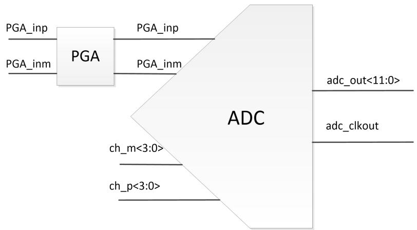


Figure 17: ADC


# 4.13.1 PGA Path

The PGA provides 42dB gain range from 0dB to 42dB in 3dB steps. 

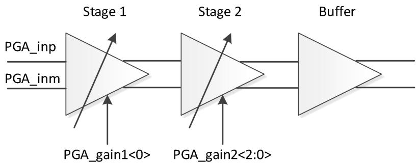


Figure 18: PGA path


<table><tr><td>pga_gain1&lt;0&gt;</td><td>Stage1 gain (v/v)</td><td>pga_gain2&lt;2&gt;</td><td>pga_gain2&lt;1&gt;</td><td>pga_gain2&lt;0&gt;</td><td>Stage2 gain (v/v)</td></tr><tr><td>0</td><td>5</td><td>0</td><td>0</td><td>0</td><td>37/4</td></tr><tr><td>1</td><td>15</td><td>0</td><td>0</td><td>1</td><td>36/5</td></tr><tr><td></td><td></td><td>0</td><td>1</td><td>0</td><td>35/6</td></tr><tr><td></td><td></td><td>0</td><td>1</td><td>1</td><td>34/7</td></tr><tr><td></td><td></td><td>1</td><td>0</td><td>0</td><td>33/8</td></tr><tr><td></td><td></td><td>1</td><td>0</td><td>1</td><td>32/9</td></tr><tr><td></td><td></td><td>1</td><td>1</td><td>0</td><td>31/10</td></tr><tr><td></td><td></td><td>1</td><td>1</td><td>1</td><td>30/11</td></tr></table>


Table 15: PGA gain


Set PGA_SEenable to “1”, PGA will be set to Single-ended mode by pulling the PGA into its Commonmode voltage. 

# 4.13.2 ADC Path

By default the ADC is configured in manual mode. In this mode, the ADC clock rate can be configured to 80k/160k/320k sample per second. Select the pair of inputs and configure it to differential or singled-ended (positive or negative). By default it is differential. After enabling, the ADC will take samples with the configured clock rate and store the data to a channel dependent memory location. For each channel a memory size of 128Byte is allocated, when it is full an interrupt bit will be flagged. Each sample of 12bits takes 2 Byte memory space. 

ADC can also be configured into auto channel sweep mode by setting the “adc_ctrl_override” bit to 0, with which the enabled channels will be sampled in the configured order automatically. The ten ADC input channels can be configured by programming their corresponding registers. Their configurations include sampling time, enable/disable, differential/single-ended, and continuous sampling/single-shot, based on the following register table. The sampled data is stored in the corresponding memory locations as in manual mode. 


Base address: 0x4000_F000


<table><tr><td>0x6C</td><td>ADC_CTL0</td><td>Register Description</td></tr><tr><td>[31:16]</td><td>auto mode config temp sense, differential inputs</td><td>channel config: [3:0] sample time, for max rate 320k: 2T to 62T, step 4T; for max rate 256k, 3T to 63T, step 4T, T is period of 1.28MHz; [4] channel enable; [5] differential 1 or single-ended 0; [6] continuous 0 or one shot 1. For auto channel sweep mode only</td></tr><tr><td>[15:0]</td><td>auto mode config PGA inputs, differential inputs</td><td>channel config: [3:0] sample time, for max rate 320k: 2T to 62T, step 4T; for max rate 256k, 3T to 63T, step 4T, T is period of 1.28MHz; [4] channel enable; [5] differential 1 or single-ended 0; [6] continuous 0 or one shot1. For auto channel sweep mode only</td></tr><tr><td>0x70</td><td>ADC_CTL1</td><td>Register Description</td></tr><tr><td>[31:16]</td><td>auto mode config input A, negative</td><td>channel config: [3:0] sample time, for max rate 320k: 2T to 62T, step 4T; for max rate 256k, 3T to 63T, step 4T, T is period of 1.28MHz; [4] channel enable; [5] differential 1 or single-ended 0; [6] continuous 0 or one shot 1.For auto channel sweep mode only</td></tr><tr><td>[15:0]</td><td>auto mode config input A positive or differential</td><td>channel config: [3:0] sample time, for max rate 320k: 2T to 62T, step 4T; for max rate 256k, 3T to 63T, step 4T, T is period of 1.28MHz; [4] channel enable; [5] differential 1 or single-ended 0; [6] continuous 0 or one shot 1. Far auto channel sweep mode only</td></tr><tr><td>0x74</td><td>ADC_CTL2</td><td>Register Description</td></tr><tr><td>[31:16]</td><td>auto mode config input B, negative</td><td>channel config: [3:0] sample time, for max rate 320k: 2T to 62T, step 4T; for max rate 256k, 3T to 63T, step 4T, T is period of 1.28MHz; [4] channel enable; [5] differential 1 or single-ended 0; [6] continuous 0 or one shot 0. For auto channel sweep mode only</td></tr><tr><td>[15:0]</td><td>auto mode config input B positive or differential</td><td>channel config: [3:0] sample time, for max rate 320k: 2T to 62T, step 4T; for max rate 256k, 3T to 63T, step 4T, T is period of 1.28MHz; [4] channel enable; [5] differential 1 or single-ended 0; [6] continuous 0 or one shot1. Forauto channel sweep mode only</td></tr><tr><td>0x78</td><td>ADC_CTL3</td><td>Register Description</td></tr><tr><td>[31:16]</td><td>auto mode config input C,</td><td>channel config: [3:0] sample time, for max rate 320k:</td></tr></table>

negative 

2T to 62T, step $4 \top ;$ for max rate 256k, 3T to 63T, step 4T, T is period of 1.28MHz; [4] channel enable; [5] differential 1 or single-ended 0; [6] continuous 0 or one shot 1. For auto channel sweep mode only 

<table><tr><td>0x78</td><td>ADC_CTL3</td><td>Register Description</td></tr><tr><td>[15:0]</td><td>auto mode config input C positive or differential</td><td>channel config: [3:0] sample time, for max rate 320k: 2T to 62T, step 4T; for max rate 256k, 3T to 63T, step 4T, T is period of 1.28MHz; [4] channel enable; [5] differential 1 or single-ended 0; [6] continuous 0 or one shot 1. For auto channel sweep mode only</td></tr></table>


Table 16: ADC channel configurations


# 4.13.3 ADC Channel <3:0> Connectivity

<table><tr><td>ADC</td><td>Hardwired</td><td>Single</td><td>differential</td><td>note</td></tr><tr><td>aio&lt;0&gt;</td><td>gpio&lt;11&gt;</td><td>√</td><td>Input B negative</td><td></td></tr><tr><td>aio&lt;1&gt;</td><td>gpio&lt;23&gt;</td><td>√</td><td>Input B positive</td><td>micphone bias reference voltage</td></tr><tr><td>aio&lt;2&gt;</td><td>gpio&lt;24&gt;</td><td>√</td><td>Input C negative</td><td></td></tr><tr><td>aio&lt;3&gt;</td><td>gpio&lt;14&gt;</td><td>√</td><td>Input C positive</td><td></td></tr><tr><td>aio&lt;4&gt;</td><td>gpio&lt;15&gt;</td><td>√</td><td>Input D negative</td><td>micphone bias</td></tr><tr><td>aio&lt;5&gt;</td><td>gpio&lt;16&gt;</td><td></td><td></td><td>32K XTAL input</td></tr><tr><td>aio&lt;6&gt;</td><td>gpio&lt;17&gt;</td><td></td><td></td><td>32K XTAL output</td></tr><tr><td>aio&lt;7&gt;</td><td>gpio&lt;18&gt;</td><td></td><td>Input A positive</td><td>pga in+</td></tr><tr><td>aio&lt;8&gt;</td><td>gpio&lt;25&gt;</td><td></td><td>Input A negative</td><td></td></tr><tr><td>aio&lt;9&gt;</td><td>gpio&lt;20&gt;</td><td>√</td><td>Input D positive</td><td>pga in-</td></tr></table>


Table 17: ADC channel connectivity


Aio<9:7,4:0>can be selected through an analog Mux by programming aio_pass<7:0> and aio_attn<7:0>. For example, register 0x4000_F020<8><0> set to 01, then Aio<0> is connected to ADC input B negative. 

<table><tr><td>0x4000_F020</td><td></td><td>Register Description</td></tr><tr><td>[15 : 8]</td><td>Attenuation ctrl</td><td>attn[7:0]. analogIO control for {aio&lt;9&gt;, aio&lt;8&gt;,aio&lt;7&gt;,aio&lt;4&gt;, aio&lt;3&gt;, aio&lt;2&gt;, aio&lt;1&gt;, aio&lt;0&gt;{attn[x], pass[x]}:00 switch off01 pass through10 attenuate to 1/411 NC</td></tr><tr><td>[7 : 0]</td><td>pass ctrl</td><td>pass[7:0]. analogIO control for {aio&lt;9&gt;, aio&lt;8&gt;,aio&lt;7&gt;,aio&lt;4&gt;, aio&lt;3&gt;, aio&lt;2&gt;, aio&lt;1&gt;, aio&lt;0}{attn[x], pass[x]}:00 switch off01 pass through10 attenuate to 1/411 NCnote: analog IO sharing</td></tr></table>

```txt
gpio<11>/aio<0>
gpio<23>/aio<1>/micphone bias reference voltage
gpio<24>/aio<2>
gpio<14>/aio<3>
gpio<15>/aio<4>/micphone bias
gpio<16>/aio<5>/32K XTAL input
gpio<17>/aio<6>/32K XTAL output
gpio<18>/aio<7>/pga in+
gpio<25>/aio<8>
gpio<20>/aio<9>/pga in-
```


Table 18: analog Mux


# 5 Absolute Maximum Ratings

Maximum ratings are the extreme limits to which PHY6222 can be exposed without permanently damaging it. Exposure to absolute maximum ratings for prolonged periods of time may affect the reliability of the PHY6222. Table 19 specifies the absolute maximum ratings for PHY6222. 

<table><tr><td>Symbol</td><td>Parameter</td><td>Min.</td><td>Max.</td><td>Unit</td></tr><tr><td colspan="5">Supply voltages</td></tr><tr><td>VDD3</td><td></td><td>-0.3</td><td>+3.6</td><td>V</td></tr><tr><td>DEC</td><td></td><td></td><td>1.32</td><td>V</td></tr><tr><td>VSS</td><td></td><td></td><td>0</td><td>V</td></tr><tr><td colspan="5">I/O pin voltage</td></tr><tr><td>VIO</td><td></td><td>-0.3</td><td>VDD + 0.3</td><td>V</td></tr><tr><td colspan="5">Environmental</td></tr><tr><td>Storage temperature</td><td></td><td>-40</td><td>+125</td><td>°C</td></tr><tr><td>MSL</td><td>Moisture Sensitivity Level</td><td></td><td>3</td><td></td></tr><tr><td>ESD HBM</td><td>Human Body Model Class 2</td><td></td><td>2</td><td>kV</td></tr><tr><td>ESD CDMQF</td><td>Charged Device Model (QFN32, 4x4 mm package)</td><td></td><td>500</td><td>V</td></tr><tr><td colspan="5">Flash memory</td></tr><tr><td>Endurance</td><td></td><td></td><td>100 000</td><td>write/erase cycles</td></tr><tr><td>Retention</td><td></td><td></td><td>10 years at 40 °C</td><td></td></tr><tr><td>Number of times an address can be written between erase cycles</td><td></td><td></td><td>2</td><td>times</td></tr></table>


Table 19: Absolute maximum ratings


# ATTENTION

OBSERVEPRECAUTIONFORHANDLING ELECTROSTATICSENSITIVEDEVICE 

HBM(HumanBody Model):Class2 

# 6 Operating Conditions

The operating conditions are the physical Parameters that PHY6222 can operate within as defined in Table 20. 

<table><tr><td>Symbol</td><td>Parameter</td><td>Min.</td><td>Typ.</td><td>Max.</td><td>Units</td></tr><tr><td>VDD3</td><td>Supply voltage, normal mode</td><td>1.8</td><td>3</td><td>3.6</td><td>V</td></tr><tr><td>tr_VDD</td><td>Supply rise time (0 V to 1.8 V)</td><td></td><td></td><td>100</td><td>ms</td></tr><tr><td>TA</td><td></td><td></td><td></td><td></td><td></td></tr><tr><td></td><td>Operating temperature (consumer)</td><td>-40</td><td>27</td><td>85</td><td>°C</td></tr><tr><td></td><td>Operating temperature (Industrial)</td><td>-40</td><td>27</td><td>105</td><td>°C</td></tr></table>


Table 20: Operating conditions


# 7 Radio Transceiver

# 7.1 Radio Current Consumption

<table><tr><td>Parameter</td><td>Description</td><td>MIN</td><td>TYP</td><td>MAX</td><td>UNIT</td></tr><tr><td>Tx only at 0dBm</td><td>with internal DC-DC @3V</td><td></td><td>4.6</td><td></td><td>mA</td></tr><tr><td>Rx Only</td><td>with internal DC-DC @3V</td><td></td><td>4</td><td></td><td>mA</td></tr></table>


Table 21: Radio current consumption


# 7.2 Transmitter Specification

<table><tr><td>Parameter</td><td>Description</td><td>MIN</td><td>TYP</td><td>MAX</td><td>UNIT</td></tr><tr><td>RF Max Output Power</td><td></td><td></td><td>10</td><td></td><td>dBm</td></tr><tr><td>RF Min Output Power</td><td></td><td></td><td>-20</td><td></td><td>dBm</td></tr><tr><td>OBW for BLE 1Mbps</td><td>20dB occupy-bandwidth for BLE modulation 1Mbps</td><td></td><td>1100</td><td></td><td>KHz</td></tr><tr><td>OBW for BLE 2Mbps</td><td>20dB occupy-bandwidth for BLE modulation 2Mbps</td><td></td><td>2300</td><td></td><td>KHz</td></tr><tr><td>OBW for GFSK 500Kbps</td><td>20dB occupy-bandwidth for GFSK modulation 2Mbps</td><td></td><td>1100</td><td></td><td>KHz</td></tr><tr><td>OBW for GFSK 125bps</td><td>20dB occupy-bandwidth for GFSK modulation 2Mbps</td><td></td><td>1100</td><td></td><td>KHz</td></tr><tr><td>Error Vector Measure</td><td>Offset EVM for OQPSK modulation</td><td></td><td>0.02</td><td></td><td></td></tr><tr><td>FDEV for BLE 1Mbps</td><td>Frequency deviation for GFSK modulation 1Mbps</td><td>160</td><td></td><td>250</td><td>KHz</td></tr><tr><td>FDEV for BLE 2Mbps</td><td>Frequency deviation for GFSK modulation 2Mbps</td><td>320</td><td></td><td>500</td><td>KHz</td></tr></table>


Table 22: Transmitter specification


# 7.3 Receiver Specification

# 7.3.1 BLE 1Mbps GFSK RX

<table><tr><td>Parameter</td><td>Description</td><td>MIN</td><td>TYP</td><td>MAX</td><td>UNIT</td></tr><tr><td>Rx Sensitivity</td><td>Sensitivity test 1Mbps BLE ideal transmitter, 37 Byte BER=1E-3</td><td></td><td>-99</td><td></td><td>dBm</td></tr><tr><td>co-channel rejection</td><td>modulated interferer in channel, 37 Byte BER=1E-3</td><td></td><td>-6</td><td></td><td>I/C dB</td></tr><tr><td>Selectivity +-1MHz</td><td>Wanted signal at -67dBm, modulated interferer at +/- 1MHz, 37 Byte BER=1E-3</td><td></td><td>7</td><td></td><td>I/C dB</td></tr><tr><td>Selectivity +-2MHz</td><td>Wanted signal at -67dBm, modulated interferer at +/- 2MHz, 37 Byte BER=1E-3</td><td></td><td>45</td><td></td><td>I/C dB</td></tr><tr><td>Selectivity +-3MHz</td><td>Wanted signal at -67dBm, modulated interferer at +/- 3MHz, 37 Byte BER=1E-3</td><td></td><td>50</td><td></td><td>I/C dB</td></tr><tr><td>Selectivity +-4MHz</td><td>Wanted signal at -67dBm, modulated interferer at +/- 4MHz, 37 Byte BER=1E-3</td><td></td><td>50</td><td></td><td>I/C dB</td></tr><tr><td>Selectivity +-5MHz or More</td><td>Wanted signal at -67dBm, modulated interferer at &gt;=+/- 5MHz, 37 Byte BER=1E-3</td><td></td><td>55</td><td></td><td>I/C dB</td></tr><tr><td>Selectivity Imag frequency</td><td>Wanted signal at -67dBm, modulated interferer at imagefrequency, 37 Byte BER=1E-3</td><td></td><td>22</td><td></td><td>I/C dB</td></tr><tr><td>Intermodulation</td><td>Wanted signal at 2402MHz, -64dBm, Two interferers at 2405 and 2408 MHz respectively, at the given power level, 37 Byte BER=1E-3</td><td></td><td>-20</td><td></td><td>dBm</td></tr><tr><td>Carrier Frequency Offset Tolerance</td><td></td><td></td><td>+- 350</td><td></td><td>KHz</td></tr><tr><td>Sample Clock Offset Tolerance</td><td></td><td></td><td>+- 120</td><td></td><td>ppm</td></tr></table>

Table 23: RX BLE 1Mbps GFSK 


7.3.2 BLE 2Mbps GFSK RX


<table><tr><td>Parameter</td><td>Description</td><td>MIN</td><td>TYP</td><td>MAX</td><td>UNIT</td></tr><tr><td>Rx Sensitivity</td><td>Sensitivity test 2Mbps BLE ideal transmitter, 37 Byte BER=1E-3</td><td></td><td>-96</td><td></td><td>dBm</td></tr><tr><td>co-channel rejection</td><td>modulated interferer in channel, 37 Byte BER=1E-3</td><td></td><td>-6</td><td></td><td>I/C dB</td></tr><tr><td>Selectivity +-1MHz</td><td>Wanted signal at -67dBm, modulated interferer at +/- 1MHz, 37 Byte BER=1E-3</td><td></td><td>-5</td><td></td><td>I/C dB</td></tr><tr><td>Selectivity +-2MHz</td><td>Wanted signal at -67dBm, modulated interferer at +/- 2MHz, 37 Byte BER=1E-3</td><td></td><td>9</td><td></td><td>I/C dB</td></tr><tr><td>Selectivity +-3MHz</td><td>Wanted signal at -67dBm, modulated interferer at +/- 3MHz, 37 Byte BER=1E-3</td><td></td><td>30</td><td></td><td>I/C dB</td></tr><tr><td>Selectivity +-4MHz</td><td>Wanted signal at -67dBm, modulated interferer at +/- 4MHz, 37 Byte BER=1E-3</td><td></td><td>40</td><td></td><td>I/C dB</td></tr><tr><td>Selectivity +-5MHz or More</td><td>Wanted signal at -67dBm, modulated interferer at &gt;=+/- 5MHz, 37 Byte BER=1E-3</td><td></td><td>55</td><td></td><td>I/C dB</td></tr><tr><td>Selectivity Imag frequency</td><td>Wanted signal at -67dBm, modulated interferer at imagefrequency, 37 Byte BER=1E-3</td><td></td><td>22</td><td></td><td>I/C dB</td></tr><tr><td>Intermodulation</td><td>Wanted signal at 2402MHz, -64dBm, Two interferers at 2405 and 2408 MHz respectively, at the given power level, 37 Byte BER=1E-3</td><td></td><td>-20</td><td></td><td>dBm</td></tr><tr><td>Carrier Frequency Offset Tolerance</td><td></td><td></td><td>+-350</td><td></td><td>KHz</td></tr><tr><td>Sample Clock Offset Tolerance</td><td></td><td></td><td>+-120</td><td></td><td>ppm</td></tr></table>


Table 24: RX BLE 2Mbps GFSK


7.3.3 500Kbps GFSK RX


<table><tr><td>Parameter</td><td>Description</td><td>MIN</td><td>TYP</td><td>MAX</td><td>UNIT</td></tr><tr><td>Rx Sensitivity</td><td>Sensitivity test 500Kbps BLE ideal transmitter, 37 Byte BER=1E-3</td><td></td><td>-100</td><td></td><td>dBm</td></tr><tr><td>co-channel rejection</td><td>modulated interferer in channel, 37 Byte BER=1E-3</td><td></td><td>-4</td><td></td><td>I/C dB</td></tr><tr><td>Selectivity +-1MHz</td><td>Wanted signal at -67dBm, modulated interferer at +/-1MHz, 37 Byte BER=1E-3</td><td></td><td>10</td><td></td><td>I/C dB</td></tr><tr><td>Selectivity +-2MHz</td><td>Wanted signal at -67dBm, modulated interferer at +/-2MHz, 37 Byte BER=1E-3</td><td></td><td>45</td><td></td><td>I/C dB</td></tr><tr><td>Selectivity +-3MHz</td><td>Wanted signal at -67dBm, modulated interferer at +/-3MHz, 37 Byte BER=1E-3</td><td></td><td>50</td><td></td><td>I/C dB</td></tr><tr><td>Selectivity +-4MHz</td><td>Wanted signal at -67dBm, modulated interferer at +/-4MHz, 37 Byte BER=1E-3</td><td></td><td>50</td><td></td><td>I/C dB</td></tr><tr><td>Selectivity +-5MHz or More</td><td>Wanted signal at -67dBm, modulated interferer at &gt;=+/- 5MHz, 37 Byte BER=1E-3</td><td></td><td>55</td><td></td><td>I/C dB</td></tr><tr><td>Selectivity Imag frequency</td><td>Wanted signal at -67dBm, modulated interferer at imagefrequency, 37 Byte BER=1E-3</td><td></td><td>24</td><td></td><td>I/C dB</td></tr><tr><td>Intermodulation</td><td>Wanted signal at 2402MHz, -64dBm, Two interferers at 2405 and 2408 MHz respectively, at the given power level, 37 Byte Ber=1E-3</td><td></td><td>-19</td><td></td><td>dBm</td></tr><tr><td>Carrier Frequency Offset Tolerance</td><td></td><td></td><td>+-350</td><td></td><td>KHz</td></tr><tr><td>Sample Clock Offset Tolerance</td><td></td><td></td><td>+-120</td><td></td><td>ppm</td></tr></table>

Table 25: RX 500Kbps GFSK 


7.3.4 125Kbps GFSK RX


<table><tr><td>Parameter</td><td>Description</td><td>MIN</td><td>TYP</td><td>MAX</td><td>UNIT</td></tr><tr><td>Rx Sensitivity</td><td>Sensitivity test 125Kbps BLE ideal transmitter, 37 Byte BER=1E-3</td><td></td><td>-105</td><td></td><td>dBm</td></tr><tr><td>co-channel rejection</td><td>modulated interferer in channel, 37 Byte BER=1E-3</td><td></td><td>-1</td><td></td><td>I/C dB</td></tr><tr><td>Selectivity +-1MHz</td><td>Wanted signal at -67dBm, modulated interferer at +/-1MHz, 37 Byte BER=1E-3</td><td></td><td>-11</td><td></td><td>I/C dB</td></tr><tr><td>Selectivity +-2MHz</td><td>Wanted signal at -67dBm, modulated interferer at +/-2MHz, 37 Byte BER=1E-3</td><td></td><td>45</td><td></td><td>I/C dB</td></tr><tr><td>Selectivity +-3MHz</td><td>Wanted signal at -67dBm, modulated interferer at +/-3MHz, 37 Byte BER=1E-3</td><td></td><td>50</td><td></td><td>I/C dB</td></tr><tr><td>Selectivity +-4MHz</td><td>Wanted signal at -67dBm, modulated interferer at +/-4MHz, 37 Byte BER=1E-3</td><td></td><td>50</td><td></td><td>I/C dB</td></tr><tr><td>Selectivity +-5MHz or More</td><td>Wanted signal at -67dBm, modulated interferer at &gt;=+/- 5MHz, 37 Byte BER=1E-3</td><td></td><td>55</td><td></td><td>I/C dB</td></tr><tr><td>Selectivity Imag frequency</td><td>Wanted signal at -67dBm, modulated interferer at imagefrequency, 37 Byte BER=1E-3</td><td></td><td>28</td><td></td><td>I/C dB</td></tr><tr><td>Intermodulation</td><td>Wanted signal at 2402MHz, -64dBm, Two interferers at 2405 and 2408 MHz respectively, at the given power level, 37 Byte BER=1E-3</td><td></td><td>-18</td><td></td><td>dBm</td></tr><tr><td>Carrier Frequency Offset Tolerance</td><td></td><td></td><td>+-350</td><td></td><td>KHz</td></tr><tr><td>Sample Clock Offset Tolerance</td><td></td><td></td><td>+-120</td><td></td><td>ppm</td></tr></table>

Table 26: RX 125Kbps GFSK 

# 7.4 RSSI Specifications

<table><tr><td>Parameter</td><td>Description</td><td>MIN</td><td>TYP</td><td>MAX</td><td>UNIT</td></tr><tr><td>RSSI Dynamic Range</td><td></td><td></td><td>70</td><td></td><td>dB</td></tr><tr><td>RSSI Accuracy</td><td>RSSI Accuracy Valid in range -100 to -30dBm</td><td></td><td>+/-2</td><td></td><td>dB</td></tr><tr><td>RSSI Resolution</td><td>Totally 7bit, from 0 to 127</td><td></td><td>1</td><td></td><td>dB</td></tr><tr><td>RSSI Period</td><td></td><td></td><td>8</td><td></td><td>us</td></tr></table>


Table 27: RSSI specifications


8 Glossary


<table><tr><td>Term</td><td>Description</td></tr><tr><td>AHB</td><td>Advanced High-performance Bus</td></tr><tr><td>AHB-AP</td><td>DAP AHB Port for debug component access thru AHB bus</td></tr><tr><td>AMBA</td><td>Advanced Microcontroller Bus Architecture</td></tr><tr><td>AON</td><td>Always-on power domain</td></tr><tr><td>APB</td><td>Advanced Peripheral Bus</td></tr><tr><td>APB-AP</td><td>DAP APB Port for debug component access thru APB bus</td></tr><tr><td>BROM</td><td>Boot ROM</td></tr><tr><td>DAP</td><td>Debug Access Port</td></tr><tr><td>ETM</td><td>Embedded trace module</td></tr><tr><td>FPU</td><td>Floating Point Unit</td></tr><tr><td>I2C</td><td>Inter-Integrated Circuit</td></tr><tr><td>I2S</td><td>Inter-IC Sound, Integrated Interchip Sound</td></tr><tr><td>ITM</td><td>Instrumentation Trace Macrocell Unit</td></tr><tr><td>JTAG</td><td>Joint Test Access Group (IEEE standard)</td></tr><tr><td>JTAG-AP</td><td>DAP&#x27;s JTAG Access Port to access debug components</td></tr><tr><td>JTAG-DP</td><td>DAP&#x27;s JTAG Debug Port used by external debugger</td></tr><tr><td>J&amp;M</td><td>Jun and Marty LLC</td></tr><tr><td>MPU</td><td>Memory Protection Unit</td></tr><tr><td>NVIC</td><td>Nested vector Interrupt Controller</td></tr><tr><td>PCR</td><td>Power Clock Reset controller</td></tr><tr><td>POR</td><td>Power on reset, it is active low in this document</td></tr><tr><td>RFIF</td><td>APB peripheral to interface RF block</td></tr><tr><td>SWD</td><td>Serial Wire DAP</td></tr><tr><td>SoC</td><td>System on chip</td></tr><tr><td>SPI</td><td>Serial Peripheral Interface</td></tr><tr><td>SRAM</td><td>Static Random Access memory</td></tr><tr><td>TWI</td><td>Two-Wire Interface</td></tr><tr><td>UART</td><td>Universal Asynchronous Receiver and Transmitter</td></tr><tr><td>WDT</td><td>Watchdog Timer</td></tr></table>


Table 28: Glossary


# 9 Ordering information

# 9.1 Chip Marking Example

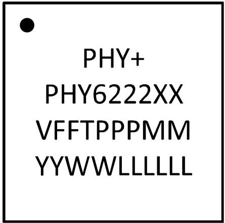


Figure 19: PHY6222XX Chip Marking Example


# 9.2 Chip Marking Rule

<table><tr><td>&lt;PHY+&gt;</td></tr><tr><td>&lt;PHY6222&gt;&lt;XX&gt;</td></tr><tr><td>&lt;V&gt;&lt;FF&gt;&lt;T&gt;&lt;PPP&gt;&lt;MM&gt;</td></tr><tr><td>&lt;YY&gt;&lt;WW&gt;&lt;LLLLLL&gt;</td></tr></table>


Figure 20: Chip Marking Rule


<table><tr><td>Abbreviation</td><td>Definition and Implemented Codes</td></tr><tr><td></td><td>PHYPLUS MICROELECTRONIC</td></tr><tr><td></td><td>PHY6222 Product</td></tr><tr><td></td><td>Package Type</td></tr><tr><td></td><td>Supply Voltage</td></tr><tr><td></td><td>Flash Size</td></tr><tr><td></td><td>Operating Temperature</td></tr><tr><td></td><td>Product Information</td></tr><tr><td></td><td>Manufacturer Information</td></tr><tr><td></td><td>2-digital Year Code</td></tr><tr><td></td><td>2-digital Week Code</td></tr><tr><td></td><td>6-digital Wafer Lot Code</td></tr></table>


Table 29: Chip Marking Rule


# 9.3 Order Code

<table><tr><td>Part No.</td><td>Package</td><td>Supply Voltage</td><td>Operating Temp. (°C)</td><td>Flash</td><td>Packing</td><td>Quantity (PCS/R)</td><td>MOQ (PCS)</td><td>Status</td></tr><tr><td>PHY6222QC-W04I</td><td>QFN32 (4x4)</td><td>1.8~3.6V</td><td>-40~105</td><td>512KB</td><td>Reel</td><td>5000</td><td>5000</td><td>MP</td></tr><tr><td>PHY6222QC-W04C</td><td>QFN32 (4x4)</td><td>1.8~3.6V</td><td>-40~85</td><td>512KB</td><td>Reel</td><td>5000</td><td>5000</td><td>MP</td></tr><tr><td>PHY6222AAQC</td><td>QFN32 (4x4)</td><td>1.8~3.6V</td><td>-40~105</td><td>512KB</td><td>Reel</td><td>5000</td><td>5000</td><td>PO</td></tr><tr><td>PHY6222-H04I</td><td>QFN32 (4x4)</td><td>2.8~3.6V</td><td>-40~105</td><td>512KB</td><td>Reel</td><td>5000</td><td>5000</td><td>PO</td></tr><tr><td>PHY6222AAQC-PD</td><td>QFN32 (4x4)</td><td>1.8~3.6V</td><td>-40~85</td><td>512KB</td><td>Reel</td><td>5000</td><td>5000</td><td>PO</td></tr><tr><td>PHY6222QC-W16C</td><td>QFN32 (4x4)</td><td>1.8~3.6V</td><td>-40~85</td><td>2MB</td><td>Reel</td><td>5000</td><td>5000</td><td>MP</td></tr><tr><td>PHY6222QH-W02C</td><td>QFN24 (3x3)</td><td>1.8~3.6V</td><td>-40~85</td><td>256KB</td><td>Reel</td><td>5000</td><td>5000</td><td>MP</td></tr></table>


Table 30: Order Code


# 10 Package dimensions

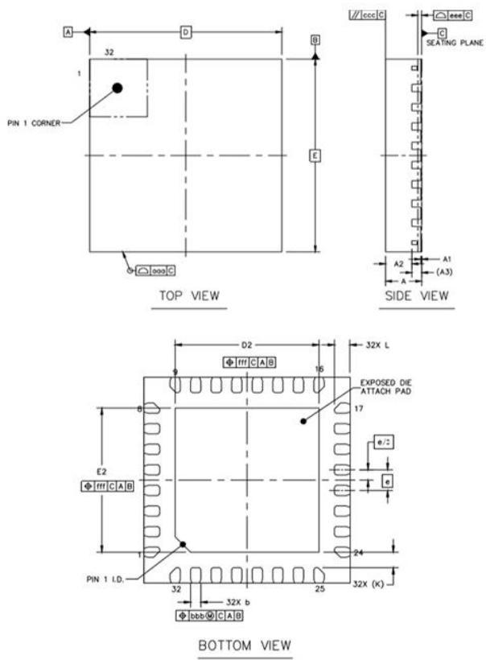


<table><tr><td colspan="2"></td><td>SYMBOL</td><td>MIN</td><td>NOM</td><td>MAX</td></tr><tr><td colspan="2">TOTAL THICKNESS</td><td>A</td><td>0.7</td><td>0.75</td><td>0.8</td></tr><tr><td colspan="2">STAND OFF</td><td>A1</td><td>0</td><td>0.02</td><td>0.05</td></tr><tr><td colspan="2">MOLD THICKNESS</td><td>A2</td><td>---</td><td>0.55</td><td>---</td></tr><tr><td colspan="2">L/F THICKNESS</td><td>A3</td><td colspan="3">0.203 REF</td></tr><tr><td colspan="2">LEAD WIDTH</td><td>b</td><td>0.15</td><td>0.2</td><td>0.25</td></tr><tr><td rowspan="2">BODY SIZE</td><td>X</td><td>D</td><td colspan="3">4 BSC</td></tr><tr><td>Y</td><td>E</td><td colspan="3">4 BSC</td></tr><tr><td colspan="2">LEAD PITCH</td><td>e</td><td colspan="3">0.4 BSC</td></tr><tr><td rowspan="2">EP SIZE</td><td>X</td><td>D2</td><td>2.7</td><td>2.8</td><td>2.9</td></tr><tr><td>Y</td><td>E2</td><td>2.7</td><td>2.8</td><td>2.9</td></tr><tr><td colspan="2">LEAD LENGTH</td><td>L</td><td>0.2</td><td>0.3</td><td>0.4</td></tr><tr><td colspan="2">LEAD TIP TO EXPOSED PAD EDGE</td><td>K</td><td colspan="3">0.3 REF</td></tr><tr><td colspan="2">PACKAGE EDGE TOLERANCE</td><td>aaa</td><td colspan="3">0.1</td></tr><tr><td colspan="2">MOLD FLATNESS</td><td>ccc</td><td colspan="3">0.1</td></tr><tr><td colspan="2">COPLANARITY</td><td>eee</td><td colspan="3">0.08</td></tr><tr><td colspan="2">LEAD OFFSET</td><td>bbb</td><td colspan="3">0.07</td></tr><tr><td colspan="2">EXPOSED PAD OFFSET</td><td>fff</td><td colspan="3">0.1</td></tr></table>


Figure 21: PHY6222QC QFN32 package dimensions


Note: dimensions are in mm, angels are in degree. 


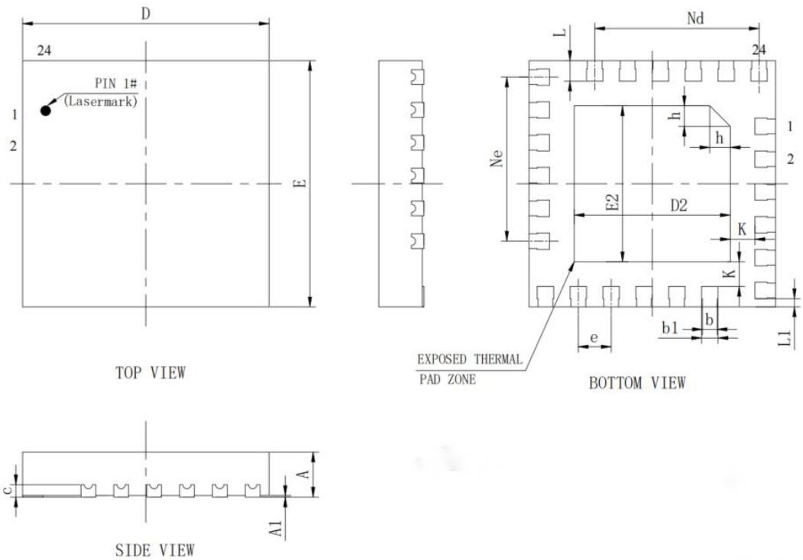


<table><tr><td rowspan="2">SYMBOL</td><td colspan="3">MILLIMETER</td></tr><tr><td>MIN</td><td>NOM</td><td>MAX</td></tr><tr><td rowspan="2">A</td><td>0.50</td><td>0.55</td><td>0.60</td></tr><tr><td>0.80</td><td>0.85</td><td>0.90</td></tr><tr><td>A1</td><td>0</td><td>0.02</td><td>0.05</td></tr><tr><td>b</td><td>0.15</td><td>0.20</td><td>0.25</td></tr><tr><td>b1</td><td colspan="3">0.18REF</td></tr><tr><td>c</td><td colspan="3">0.152REF</td></tr><tr><td>D</td><td>2.90</td><td>3.00</td><td>3.10</td></tr><tr><td>D2</td><td>1.80</td><td>1.90</td><td>2.00</td></tr><tr><td>e</td><td colspan="3">0.40BSC</td></tr><tr><td>Ne</td><td colspan="3">2.00BSC</td></tr><tr><td>Nd</td><td colspan="3">2.00BSC</td></tr><tr><td>E</td><td>2.90</td><td>3.00</td><td>3.10</td></tr><tr><td>E2</td><td>1.80</td><td>1.90</td><td>2.00</td></tr><tr><td>L</td><td>0.20</td><td>0.25</td><td>0.30</td></tr><tr><td>L1</td><td colspan="3">0.10REF</td></tr><tr><td>h</td><td>0.20</td><td>0.25</td><td>0.30</td></tr><tr><td>K</td><td colspan="3">0.30REF</td></tr></table>


Figure 22: PHY6222QH QFN24 package dimensions


Note: dimensions are in mm, angels are in degree. 


# 11 Sample Application and Layout Guide

# 11.1 Sample Application (PHY6222QC QFN32)

# 11.1.1 With DCDC

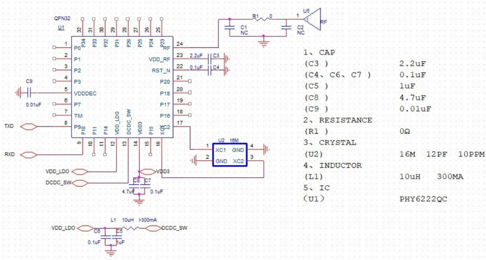


Figure 23: Sample application of PHY6222QC QFN32 with DCDC


* If RF TX output power > 5dBm, C3=4.7uF


# 11.1.2 Without DCDC

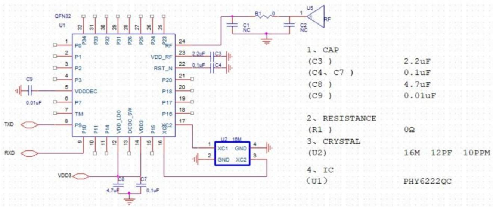


Figure 24: Sample application of PHY6222QC QFN32 without DCDC


* If RF TX output power > 5dBm, C3=4.7uF


# 11.2 Sample Application (PHY6222QH QFN24)

# 11.2.1 With DCDC

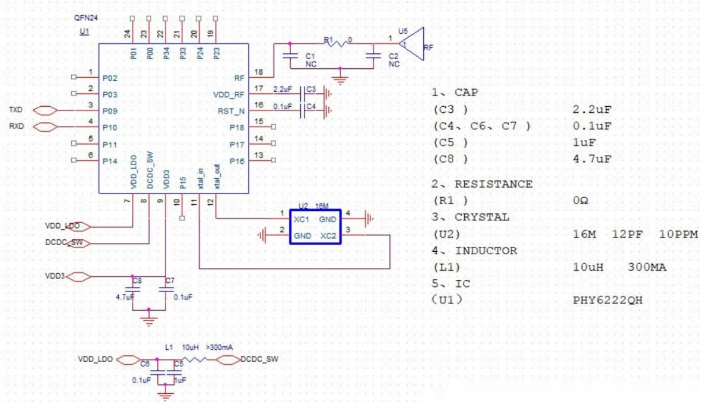


Figure 25: Sample application of PHY6222QH QFN24 with DCDC


* If RF TX output power > 5dBm, C3=4.7uF


# 11.2.2 Without DCDC

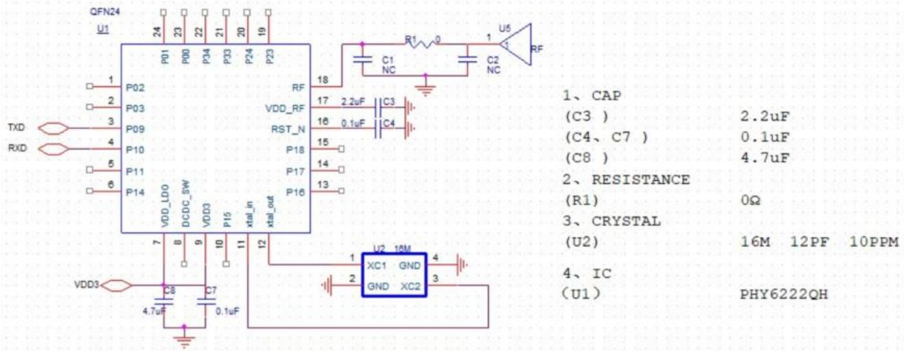


Figure 26: Sample application of PHY6222QH QFN24 without DCDC


* If RF TX output power > 5dBm, C3=4.7uF


# 11.3 Layout Guide

# 11.3.1 Placement

1. RF matching/Loop filter leading to antenna should be isolated from any other AC/DC signal as much as possible; 

2. Xtal/OSC clock is a noise source to other circuits, keep clock trace as short as possible and away from any important area; 

3. LDO’s are sensitive and could be easily contaminated, care should be taken for the environment; 

4. Antenna is the main RF radiation point, other important blocks should be shielded or away from this area. 

# RF traces

1. Define RF line width with given dielectric thickness (thickness of PCB dielectric layer to ground plain) to achieve 50ohm impedance; this is mainly for the RF line connecting to matching/loop filter and antenna. 

2. Differential traces should be kept in the same length and component should be placed symmetrically; 

3. Certain length of RF trace should be treated as part of RF matching. 

# 11.3.2 Bypass Capacitor

1. Each VDD pin needs a bypass capacitor to release chip internal noise and block noise from power supply. 

2. For power traces, bypass capacitors should be placed as close as possible to VDD pins. 

3. Use one large and one small capacitor when the pin needs two capacitors. Typically the capacitance of the larger capacitor is about 100 times of that of the smaller one. The smaller capacitor usually has better quality factor than the larger one. Place the larger capacitor closer to the pin. 

4. The capacitors of Loop filter need to have larger clearance to prevent EMC/EMI issue. 

5. Ground via should be close to the Capacitor GND side, and away from strong signals. 

# 11.3.3 Layer Definition

1. Normally 4 layer PCB is recommended. 

2. RF trace must be on the surface layer, i.e. top layer or bottom. 

3. The second layer of RF PCB must be “Ground ” layer , for both signal ground and RF reference ground , DO NOT put any other trace or plane on second layer, otherwise “antenna effect” will complicate debug process. 

4. Power plane generally is on the 3rd layer. 

5. Bottom layer is for “signal ” layer. 

6. If two layer PCB is used, quality will degrade in general. More care needs to be taken. Try to maximize ground plane, avoid crossing of signal trace with other noise lines or VDD, shield critical signal line with ground plane, maximize bypass capacitor and number of ground vias. 

# 11.3.4 Reference clock and trace

1. Oscillator signal trace is recommended to be on the 1st layer; 

2. DO NOT have any trace around or across the reference clock (oscillator) trace. 

3. Isolate the reference clock trace and oscillator by having more GND via around. 

4. DO NOT have any other traces under the Oscillator. 

# 11.3.5 Power line or plane

1. Whether to use power plain or power line depend on the required current, noise and layout condition. For RF chip, we generally suggest to use power line to bring power into IC pin. Line has parasitic inductance, which forms a low pass filter to reduce the noise traveling around PCB. 

2. Add more conductive via on the current source, it will increase max current limit and reduce inductance of via. 

3. Add some capacitor alone the power trace when power line travels a long distance. 

4. DO NOT place power line or any plane under RF trace or oscillator and its clock trace , the strong clock or RF signal would travel with power line. 

# 11.3.6 Ground Via

1. Ground Via must be as close to the ground pad of bypass capacitor as possible , too much distance between via and ground pad will reduce the effect of bypass capacitor. 

2. Having as many ground via as possible. 

3. Place ground via around RF trace, the RF trace should be shielded with via trail. 