

natural_image

Blue circular icon with white stylized letter 'A' and human figure icons, no text or symbols present

# PB-03F

版本 V1.0.0

版权@2021

文件履历表

<table><tr><td>版本</td><td>日期</td><td>制定/修订内容</td><td>制定</td><td>核准</td></tr><tr><td>V1.0.0</td><td>2021.11.23</td><td>首次制定</td><td>袁南南</td><td>关宁</td></tr><tr><td></td><td></td><td></td><td></td><td></td></tr><tr><td></td><td></td><td></td><td></td><td></td></tr><tr><td></td><td></td><td></td><td></td><td></td></tr><tr><td></td><td></td><td></td><td></td><td></td></tr><tr><td></td><td></td><td></td><td></td><td></td></tr><tr><td></td><td></td><td></td><td></td><td></td></tr><tr><td></td><td></td><td></td><td></td><td></td></tr><tr><td></td><td></td><td></td><td></td><td></td></tr><tr><td></td><td></td><td></td><td></td><td></td></tr><tr><td></td><td></td><td></td><td></td><td></td></tr><tr><td></td><td></td><td></td><td></td><td></td></tr><tr><td></td><td></td><td></td><td></td><td></td></tr><tr><td></td><td></td><td></td><td></td><td></td></tr><tr><td></td><td></td><td></td><td></td><td></td></tr><tr><td></td><td></td><td></td><td></td><td></td></tr></table>

# 目录

1. .

1.1. . 6

2. .. 6

2.1. .   
2.2. .   
2.3. .   
2.4.功耗. 8

3. .. 9   
4. .. . 10   
5. . 12   
6. .. 13

6.1. . . 13   
6.2. S .. . 14   
6.3. . 14   
6.4. . 15

7. .. 16

7.1. . . 16   
7.2. . 17   
7.3. .. 17   
7.4. GPIO . . 19

8. . 20   
9. .. . 21   
10.产品包装信息 22  
11. .. 22

免责申明和版权公告. . 23

.. 23

# 1.产品概述

PB-03F是由深圳市安信可科技有限公司开发的蓝牙模块。该模块核心处理器芯片PHY6252(SSOP24) (SoC) (IoT)动设备、可穿戴电子设备、智能家居等各种应用而设计。

PHY6252(SSOP24) BLE 5.264 KB SRAM 256KB flash 96 KB ROM 256bit efuse状态，能够满足各种应用场景的功耗需求。射频输出功率可调节功能等特性，可以实现通信距离、通信速率和功耗之间的最佳平衡。

PB-03F UART, PWM, ADC, I2C, SPI, PDM, DMA 19 IO

PB-03F模块具有多种特有的硬件安全机制。硬件加密加速器支持AES算法。

PB-03F Bluetooth5.2 Bluetooth mesh 125Kbps500Kbps 1Mbps 2Mbps

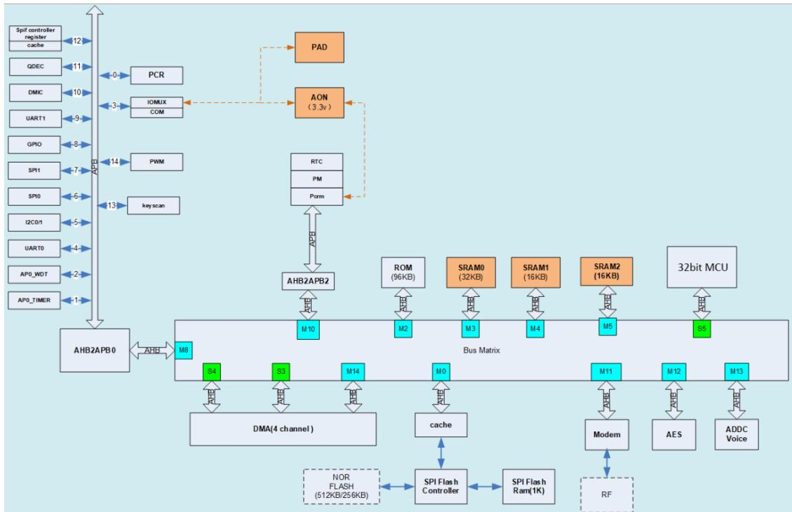

flowchart

```mermaid
graph TD
    A["Spif controller register cache"] -->|12| B["APB"]
    C["QDEC"] -->|11| B
    D["DMIC"] -->|10| B
    E["UART1"] -->|9| B
    F["GPIO"] -->|8| B
    G["SP1"] -->|7| B
    H["SP0"] -->|6| B
    I["I2C0/1"] -->|5| B
    J["UART0"] -->|4| B
    K["AP0_WDT"] -->|2| B
    L["AP0_TIMER"] -->|1| B
    B --> M["APB"]
    M --> N["PCR"]
    N --> O["IOMUX COM"]
    O --> P["PWM"]
    P --> Q["key scan"]
    R["ADC"] --> S["AHB2APB0"]
    T["ADC"] --> U["M8"]
    V["ADC"] --> W["M10"]
    X["ADC"] --> Y["M2"]
    Z["ADC"] --> AA["M3"]
    AB["ADC"] --> AC["M4"]
    AD["ADC"] --> AE["M5"]
    AF["ADC"] --> AG["S5"]
    AH["ADC"] --> AI["M11"]
    AJ["ADC"] --> AK["M12"]
    AL["ADC"] --> AM["M13"]
    AN["ADC"] --> AO["NOR FLASH (512KB/256KB)"]
    AP["ADC"] --> AQ["M14"]
    AR["ADC"] --> AS["M0"]
    AT["ADC"] --> AU["cache"]
    AV["ADC"] --> AW["SPI Flash Controller"]
    AX["ADC"] --> AY["SPI Flash Ram(1K)"]
    AZ["ADC"] --> BA["RF"]
    BB["ADC"] --> BC["SRAM0 (32KB)"]
    BD["ADC"] --> BE["SRAM1 (16KB)"]
    BF["ADC"] --> BG["SRAM2 (16KB)"]
    BH["ADC"] --> BI["32bit MCU"]
    BJ["ADC"] --> BK["ROM (96KB)"]
    BL["ADC"] --> BM["AON (3.3v)"]
    BN["PAD"] --> BO["AHB2APB2"]
    BP["RTC"] --> BQ["AHB2APB2"]
    BR["PM"] --> BS["AHB2APB2"]
    BT["Porm"] --> BU["AHB2APB2"]
    BV["AHB2APB2"] --> BW["Bus Matrix"]
    BX["Bus Matrix"] --> BY["Bus Matrix"]
    CA["DMA(4 channel)"] --> CB["M10"]
    DA["M14"] --> DB["M2"]
    DC["M0"] --> DD["M3"]
    EE["M11"] --> F["F"]
    GA["M12"] --> H["F"]
    BI["M13"] --> IN["F"]
    AJ["M13"] --> IA["F"]
```

图1主芯片架构图

# 1.1.

◼ BLE5.2 125Kbps 500Kbps 1Mbps 2Mbps   
◼ 64 KB SRAM 256KB flash, 96 KB ROM 256bit efuse   
◼ UART/GPIO/ADC/PWM/I2C/SPI/PDM/DMA   
1 SMD-22  
◼ 支持多种休眠模式，深度睡眠电流小于1uA  
◼ 支持串口本地升级和远程固件升级 (FOTA)  
■通用AT指令可快速上手  
1支持二次开发，集成了Windows开发环境

# 2.主要参数

表1主要参数说明

<table><tr><td>模组型号</td><td>PB-03F</td></tr><tr><td>封装</td><td>SMD-22</td></tr><tr><td>尺寸</td><td>24.0*16.0*3.1(±0.2)mm</td></tr><tr><td>天线形式</td><td>板载天线</td></tr><tr><td>频谱范围</td><td>2400 ~ 2483.5MHz</td></tr><tr><td>工作温度</td><td>-40 °C ~ 85 °C</td></tr><tr><td>存储环境</td><td>-40 °C ~ 125 °C , &lt; 90%RH</td></tr><tr><td>供电范围</td><td>供电电压 2.7V ~ 3.6V,供电电流 &gt;200mA</td></tr><tr><td>支持接口</td><td>UART/GPIO/ADC/PWM/I2C/I2S/SPI/PDM/DMA</td></tr><tr><td>可用 IO 数量</td><td>19 个</td></tr><tr><td>串口速率</td><td>默认 115200 bps</td></tr><tr><td>蓝牙</td><td>BLE 5.2</td></tr><tr><td>安全性</td><td>AES-128</td></tr><tr><td>SPI Flash</td><td>256KB</td></tr></table>

# 2.1.

PB-03F模块是静电敏感设备，在搬运时需要采取特殊预防措施。

  
2 ESD

# 2.2.

表2电气特性表 

<table><tr><td colspan="2">参数</td><td>条件</td><td>最小值</td><td>典型值</td><td>最大值</td><td>单位</td></tr><tr><td colspan="2">供电电压</td><td>VDD</td><td>2.7</td><td>3.3</td><td>3.6</td><td>V</td></tr><tr><td rowspan="3">I/O</td><td> $V_{IL}/V_{IH}$ </td><td>-</td><td>-0.3/0.75VDD</td><td>-</td><td>0.25VDD/VDD+0.3</td><td>V</td></tr><tr><td> $V_{OL}/V_{OH}$ </td><td>-</td><td>N/0.8VIO</td><td>-</td><td>0.1VIO/N</td><td>V</td></tr><tr><td> $I_{MAX}$ </td><td>-</td><td>-</td><td>-</td><td>12</td><td>mA</td></tr></table>

# 2.3.

表3蓝牙射频性能表

<table><tr><td>描述</td><td colspan="3">典型值</td><td>单位</td></tr><tr><td>工作频率</td><td colspan="3">2400 - 2483.5</td><td>MHz</td></tr><tr><td colspan="5">输出功率</td></tr><tr><td>模式</td><td>最小值</td><td>典型值</td><td>最大值</td><td>单位</td></tr><tr><td>BLE 2Mbps</td><td>-20</td><td>8</td><td>10</td><td>dBm</td></tr><tr><td>BLE 1Mbps</td><td>-20</td><td>8</td><td>10</td><td>dBm</td></tr><tr><td>BLE 500Kbps</td><td>-20</td><td>8</td><td>10</td><td>dBm</td></tr><tr><td>BLE 125kbps</td><td>-20</td><td>8</td><td>10</td><td>dBm</td></tr><tr><td colspan="5">接收灵敏度</td></tr><tr><td>模式</td><td>最小值</td><td>典型值</td><td>最大值</td><td>单位</td></tr><tr><td>BLE 2Mbps</td><td>-</td><td>-93</td><td>-</td><td>dBm</td></tr><tr><td>BLE 1Mbps</td><td>-</td><td>-96</td><td>-</td><td>dBm</td></tr><tr><td>BLE 500Kbps</td><td>-</td><td>-97</td><td>-</td><td>dBm</td></tr><tr><td>BLE 125Kbps</td><td>-</td><td>-102</td><td>-</td><td>dBm</td></tr></table>

# 2.4.功耗

下列功耗数据是基于3.3V 的电源、 $2 5 ^ { \circ } \mathrm { C }$ 的环境温度，并使用内部稳压器测得。

◼ 所有测量均在没有 SAW 滤波器的情况下，于天线接口处完成。  
◼ TX\_Burst\_Test & RX\_Burst\_Test

表4功耗表

<table><tr><td>模式</td><td>最小值</td><td>平均值</td><td>最大值</td><td>单位</td></tr><tr><td>TX_Burst_Test Power output 8dBm</td><td>-</td><td>11.5</td><td>-</td><td>mA</td></tr><tr><td>TX_Burst_Test Power output 5dBm</td><td>-</td><td>9</td><td>-</td><td>mA</td></tr><tr><td>TX_Burst_Test Power output 0dBm</td><td>-</td><td>8</td><td>-</td><td>mA</td></tr><tr><td>RX_Burst_Test</td><td>-</td><td>9.4</td><td>-</td><td>mA</td></tr><tr><td>深度 Sleep(带广播,时间间隔1秒)</td><td>-</td><td>50.58</td><td>-</td><td>uA</td></tr><tr><td>深度 Sleep(带广播,时间间隔2秒)</td><td>-</td><td>28.25</td><td>-</td><td>uA</td></tr><tr><td>深度 Sleep(不带广播)</td><td>-</td><td>7.2</td><td>-</td><td>uA</td></tr><tr><td>Power Off</td><td>-</td><td>0.57</td><td>-</td><td>uA</td></tr></table>

# 3.外观尺寸

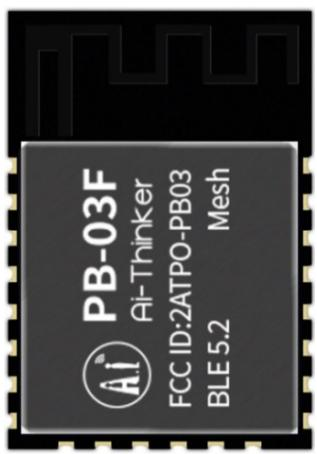

text_image

PB-03F
AI-Thinker
FCC ID:2ATPO-PB03
BLE5.2
Mesh

正面

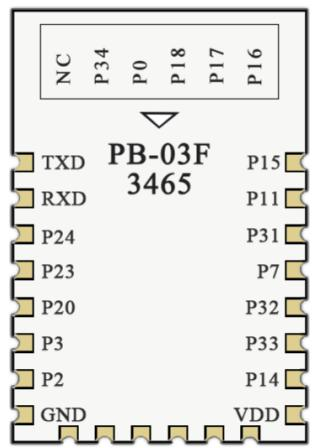

text_image

NC P34 P0 P18 P17 P16
PB-03F
3465
TXD P15
RXD P11
P24 P31
P23 P7
P20 P32
P3 P33
P2 P14
GND VDD

背面

图3模组外观图 (渲染图仅供参考，以实物为准)  
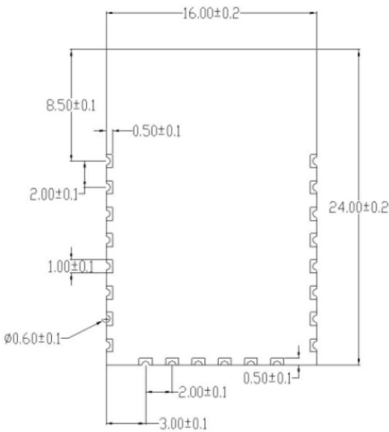

text_image

16.00±0.2
8.50±0.1
0.50±0.1
2.00±0.1
1.00±0.1
Ø0.60±0.1
24.00±0.2
2.00±0.1
3.00±0.1
0.50±0.1

正面

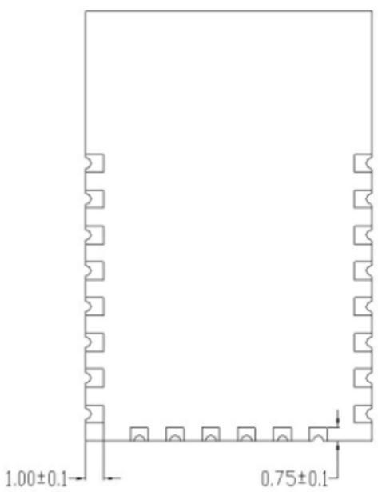

text_image

1.00±0.1
0.75±0.1

背面  
图4模组尺寸图

# 4.

PB-03F 模组共接出 22个管脚，如管脚示意图，管脚功能定义表是接口定义。

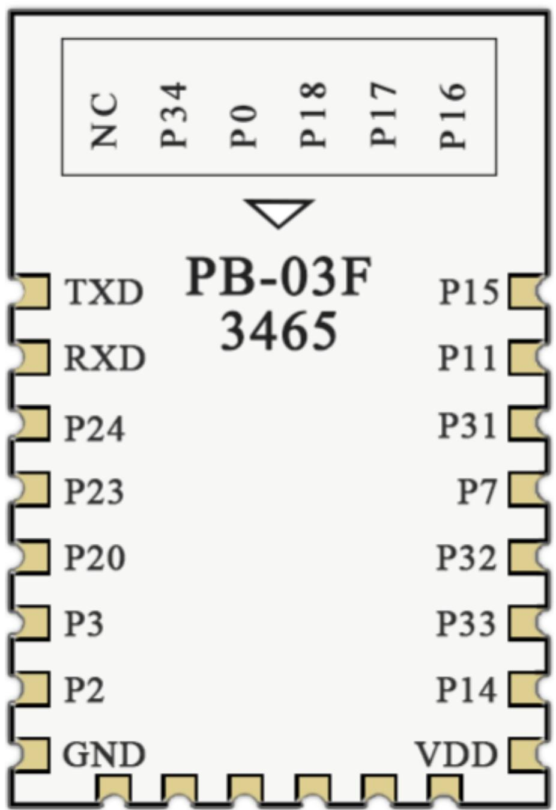

text_image

NC P34 P0 P18 P17 P16
▼
TXD PB-03F 3465 P15
RXD P11
P24 P31
P23 P7
P20 P32
P3 P33
P2 P14
GND VDD

图5模组管脚示意图 (背部图)

表6管脚功能定义表

<table><tr><td>脚序</td><td>名称</td><td>功能说明</td></tr><tr><td>1</td><td>P15</td><td>GPIO15/ADC input 4/micbias output</td></tr><tr><td>2</td><td>P11</td><td>GPIO11/ADC input 0</td></tr><tr><td>3</td><td>P31</td><td>GPIO31</td></tr><tr><td>4</td><td>P7</td><td>GPIO7</td></tr><tr><td>5</td><td>P32</td><td>GPIO32</td></tr><tr><td>6</td><td>P33</td><td>GPIO33</td></tr><tr><td>7</td><td>P14</td><td>GPIO14/ADC input 3</td></tr><tr><td>8</td><td>VDD</td><td>电源输入</td></tr><tr><td>9</td><td>P16</td><td>GPIO16/32.768KHz crystal input</td></tr><tr><td>10</td><td>P17</td><td>GPIO17/32.768KHz crystal output</td></tr><tr><td>11</td><td>P18</td><td>GPIO18/ADC input 7/PGA negative input</td></tr><tr><td>12</td><td>P0</td><td>GPIO0</td></tr><tr><td>13</td><td>P34</td><td>GPIO34</td></tr><tr><td>14</td><td>NC</td><td>空脚</td></tr><tr><td>15</td><td>GND</td><td>接地(电源负极)</td></tr><tr><td>16</td><td>P2</td><td>GPIO2/SWD debug data inout</td></tr><tr><td>17</td><td>P3</td><td>GPIO3/SWD debug clock</td></tr><tr><td>18</td><td>P20</td><td>GPIO20/ADC input 9/PGA positive input</td></tr><tr><td>19</td><td>P23</td><td>GPIO23/ADC input 1/micbias reference</td></tr><tr><td>20</td><td>P24</td><td>GPIO24/ADC input 2</td></tr><tr><td>21</td><td>P10</td><td>RXD/GPIO10</td></tr><tr><td>22</td><td>P9</td><td>TXD/GPIO9</td></tr></table>

# 5.

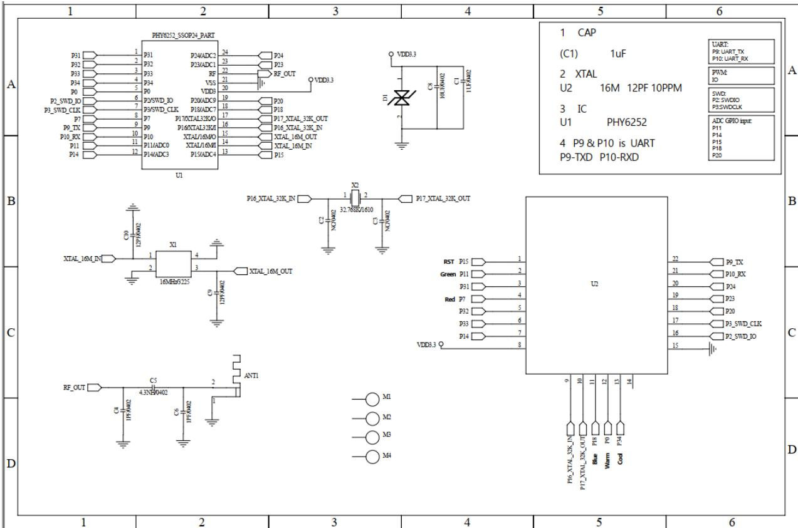

text_image

1
2
3
4
5
6
A
PHY0252_SSOP04_PART
P31 P31 P24ADC2 24 P24
P32 P32 P23ADC1 23 P23
P33 P33 RF RF_OUT
P34 P34 VSS 21
P35 P35 VDD3 20
P36 P36 VDD3
P37 P37 P20ADC9 19 P20
P38 P38 P18 ADC7 18 P18
P39 P39 P17XTAL33KOUT 17 P17_XTAL_33K_IN
P40 P40 P16XTAL33KOUT 16 P16_XTAL_33K_IN
P41 P41 P10 XTAL/16M0 15 XTAL_16M_OUT
P42 P42 P11 ADC0 XTAL/16M0 14 XTAL_16M_IN
P43 P43 P14 ADC3 P15 ADC4 13 P15
U1
B
C
D
1 CAP
(C1) 1uF
UART
PR_UART_TX
P10_UART_RX
2 XTAL
U2 16M 12PF 10PPM
PWM
IO
SWX:
P2-SWDOI
P3-SWDCCLK
3 IC
U1 PHY6252
ADC GPIO input:
P11
P14
P15
P18
P20
4 P9 & P10 is UART
P9-TXD P10-RXD
C10 C20 NCAM02 X2 2 P17_XTAL_33K_OUT
XTAL_16M_IN 1 2 3 4 5 6 7 8 9 10 11 12 13 14
X1 16MBH0225 XTAL_16M_OUT
C2 127PM02 ANT1 M1 M2 M3 M4 VDD3.3 U2
RST P15 1 Green P11 2 P31 3 Red P7 4 P32 5 P33 6 P14 7 8
Green P11 2 P31 3 Red P7 4 P32 5 P33 6 P14 7 8
VDD3.3 U2
P9_XTX
P10_RX
P24
P23
P20
P3_SWD_CLK
P2_SWD_IO
P6_XTAL_33K_IN
P17_XTAL_33K_OUT
P18_XTAL_33K_OUT
P29_XTAL_33K_OUT
P30_XTAL_33K_OUT
P31_XTAL_33K_OUT
P32_XTAL_33K_OUT
P33_XTAL_33K_OUT
P34_XTAL_33K_OUT

图6模组原理图

# 6.天线参数

# 6.1.

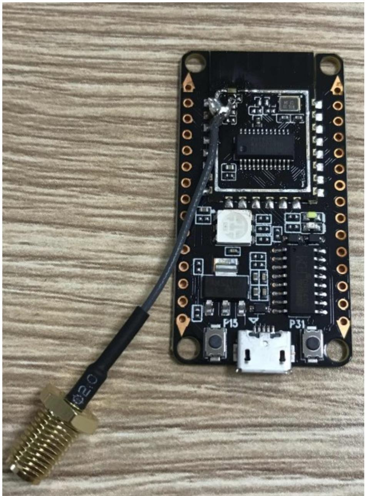

natural_image

Close-up of an Arduino PiC250 microcontroller board with visible circuitry and connector, placed on a wooden surface (no text or symbols)

图7天线测试条件

# 6.2. S

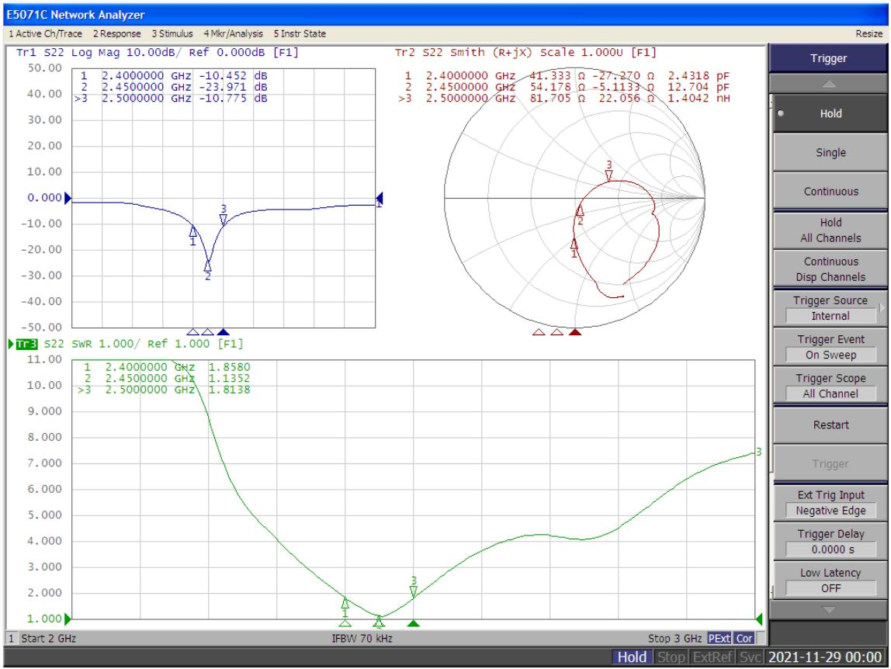

line

| Frequency (GHz) | SWR     |
| --------------- | ------- |
| 2.4000000       | 1.8580  |
| 2.4500000       | 1.1352  |
| 2.5000000       | 1.8138  |

8 S

# 6.3.

表7天线增益和效率

<table><tr><td>Frequency ID</td><td>1</td><td>2</td><td>3</td><td>4</td><td>5</td><td>6</td><td>7</td><td>8</td><td>9</td><td>10</td><td>11</td></tr><tr><td>Frequency (MHz)</td><td>2400.0</td><td>2410.0</td><td>2420.0</td><td>2430.0</td><td>2440.0</td><td>2450.0</td><td>2460.0</td><td>2470.0</td><td>2480.0</td><td>2490.0</td><td>2500.0</td></tr><tr><td>Gain (dBi)</td><td>1.99</td><td>1.84</td><td>2.15</td><td>1.68</td><td>1.70</td><td>1.52</td><td>1.38</td><td>1.45</td><td>1.78</td><td>1.47</td><td>1.62</td></tr><tr><td>Efficiency (%)</td><td>77.76</td><td>76.14</td><td>81.08</td><td>73.60</td><td>74.80</td><td>71.89</td><td>68.92</td><td>69.55</td><td>72.83</td><td>66.53</td><td>69.30</td></tr></table>

# 6.4.

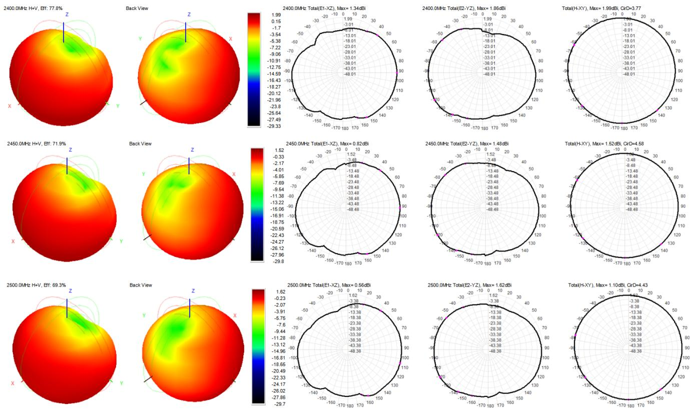  
图9天线场型图

# 7．设计指导

# 7.1.

(>= 200mA, DC-DC LDO )

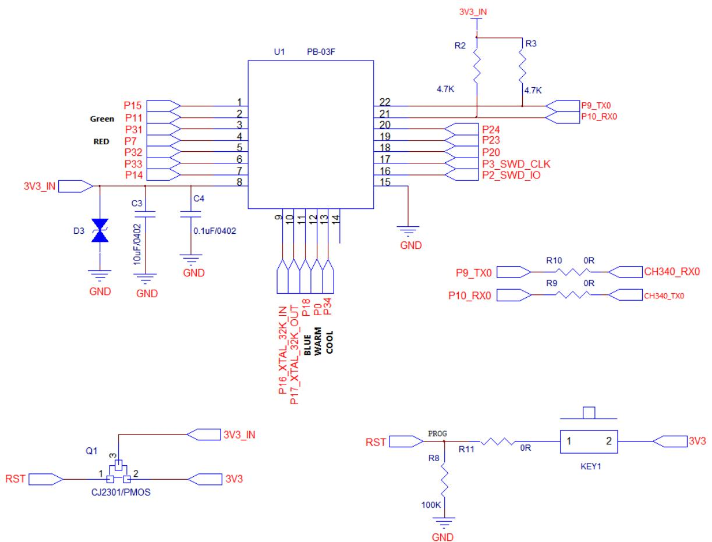

text_image

3V3_IN
Green
RED
P15
P11
P31
P7
P32
P33
P14
3V3_IN
D3
GND
C3
10uF/0402
GND
C4
0.1uF/0402
U1 PB-03F
22
21
20
19
18
17
16
15
9 10 11 12 13 14
GND
P24
P23
P20
P3_SWD_CLK
P2_SWD_IO
P9_TX0
P10_RX0
R2
R3
4.7K
P9_TX0 R10 0R CH340_RX0
P10_RX0 R9 0R CH340_TX0
P16_XTAL_32K_IN P17_XTAL_32K_OUT P18 BLUE WARM COOL P34
Q1 3V3_IN
RST CJ2301/PMOS 3V3
RST PROG R11 0R KEY1 3V3
R8 100K GND

图10应用电路图

# 注意：

因为PB-03F没有复位引脚，所以我们用断电的方式来实现复位，可以在电源输入端用一个PMOS来实现断电的动作实现模组的复位。  
TX&RX串口线路上，预留2个电阻，串联在线路中。用于防止串口自带的3.3V电压会影响到模组的复位。

# 7.2.

◼ 在主板上的安装位置，建议以下2种方式：

方案一：把模组放在主板边沿，且天线区域伸出主板边沿。

方案二：把模组放在主板边沿，主板边沿在天线位置挖空一个区域。

■为了满足板载天线的性能，天线周边禁止放置金属件，远离高频器件。

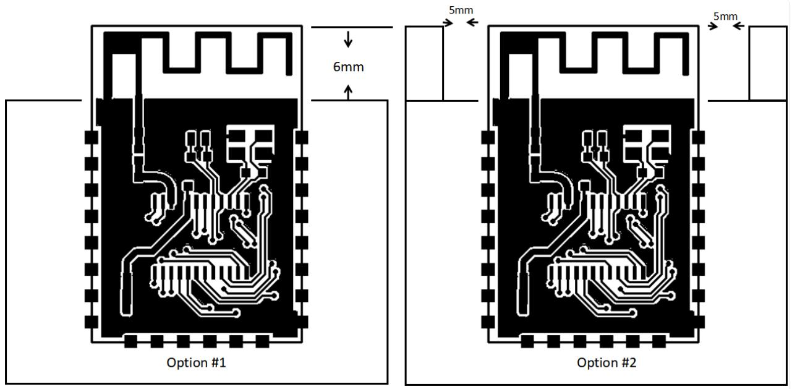

text_image

Option #1
6mm
5mm
Option #2
5mm

图11天线布局示意图

# 7.3.

推荐3.3V 电压，峰值 200mA以上电流。  
■建议使用 LDO 供电；如使用 DC-DC建议纹波控制在 30mV 以内。  
DC-DC供电电路建议预留动态响应电容的位置，可以在负载变化较大时，优化输出纹波。  
◼ 3.3V ESD

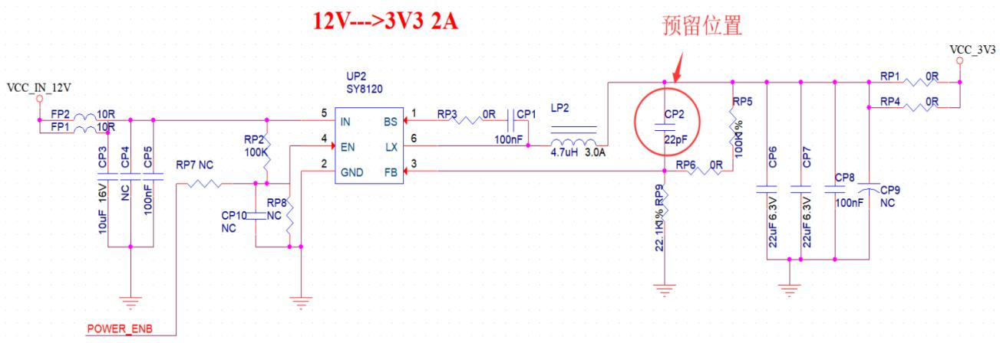

text_image

12V--->3V3 2A
VCC_IN_12V
FP2
FP1
10R
10R
CP3
10uF 16V
NC
100nF
CP4
CP5
RP7 NC
RP2
100K
CP10 NC
RP8 NC
GND
UP2
SY8120
IN
BS
EN
LX
FB
5
4
2
3
6
1
RP3
0R
CP1
100nF
LP2
4.7uH 3.0A
预留位置
CP2
22pF
RP6
0R
100k%
RP5
22.1k% RP9
CP6
CP7
CP8
100nF
CP9 NC
VCC_3V3
RP1 0R
RP4 0R

12 DC-DC

# 7.4. GPIO

模组外围引出了一些IO口，如需使用建议在IO口上串联10-100 欧姆的电阻。这样可以抑制过冲，使两边电平更平稳。对 EMI和 ESD都有帮助。  
特殊IO口的上下拉，需参考规格书的使用说明，此处会影响到模组的启动配置。  
■模组的IO口是3.3V如果主控与模组的IO口电平不匹配，需要增加电平转换电路。  
如果IO口直连到外围接口，或者排针等端子，建议在IO口走线靠近端子处预留 ESD器件。

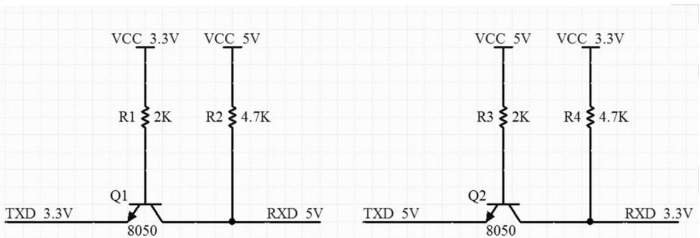

text_image

VCC 3.3V
R1 2K
VCC 5V
R2 4.7K
Q1
TXD 3.3V
8050
RXD 5V
VCC 5V
R3 2K
VCC 3.3V
R4 4.7K
Q2
TXD 5V
8050
RXD 3.3V

图13电平转换电路

# 8.回流焊曲线图

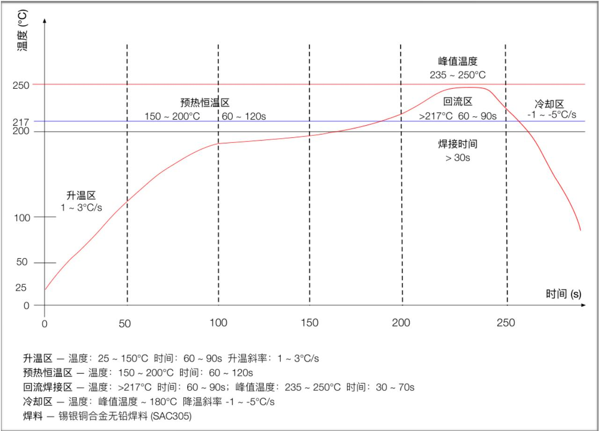

line

| 时间 (s) | 温度 (°C) | 升温 (°C/s) |
| -------- | --------- | ----------- |
| 0        | 25        | 1 ~ 3      |
| 50       | 100       | 1 ~ 3      |
| 100      | 180       | 150 ~ 200   |
| 150      | 200       | 60 ~ 120    |
| 200      | 220       | >217°C      |
| 250      | 240       | 235 ~ 250   |
| 275      | 217       | -1 ~ -5°C   |

图14回流焊曲线图

# 9.产品相关型号

表8产品相关型号表

<table><tr><td>产品型号</td><td>供电</td><td>封装</td><td>尺寸</td><td>天线接口</td></tr><tr><td>PB-03F</td><td>2.7V~3.6V,I&gt;200mA</td><td>SMD-22</td><td>24.0*16.0*3.1(±0.2)mm</td><td>板载PCB天线</td></tr><tr><td>PB-03M</td><td>2.7V~3.6V,I&gt;200mA</td><td>DIP-18金手指插件</td><td>18.0*18.0*2.8(±0.2)mm</td><td>板载PCB天线</td></tr><tr><td>PB-03</td><td>2.7V~3.6V,I&gt;200mA</td><td>SMD-61</td><td>16.6*13.2*2.8(±0.2)mm</td><td>板载PCB天线</td></tr><tr><td>NodeMCU-PB-03F-Kit</td><td>5V,I&gt;200mA</td><td>DIP-30</td><td>49.3*25.4*12.9(±0.2)mm</td><td>板载PCB天线</td></tr><tr><td>NodeMCU-PB-03M-Kit</td><td>5V,I&gt;200mA</td><td>DIP-20</td><td>32.8*28.6*18.3(±0.2)mm</td><td>板载PCB天线</td></tr><tr><td>NodeMCU-PB-03-Kit</td><td>5V,I&gt;200mA</td><td>DIP-30</td><td>49.3*25.4*12.9(±0.2)mm</td><td>板载PCB天线</td></tr><tr><td colspan="5">产品相关信息:https://docs.ai-thinker.com</td></tr></table>

# 10．产品包装信息

PB-03F 800pcs/

natural_image

Blue film reel with five black blades and a central hole (no text or symbols)

图15包装编带图

# 11.

安信可官网

官方论坛

DOCS

安信可领英

天猫旗舰店

淘宝店铺

阿里国际站

support@aithinker.com

sales@aithinker.com

overseas@aithinker.com

C 403 408-410

0755-29162996

text_image

QR code with central logo and WeChat Pay icon, likely for mobile payment or social media linking

问问安信可

text_image

Blue QR code with central logo containing two stylized human figures and a Wi-Fi symbol

安信可公众号

# 免责申明和版权公告

本文中的信息，包括供参考的URL地址，如有变更，恕不另行通知。

文档“按现状”提供，不负任何担保责任，包括对适销性、适用于特定用途或非侵权性的任何担保，和任何提案、规格或样品在他处提到的任何担保。本文档不负任何责任，包括使用本文档信息产生的侵犯任何专利权行为的责任。本文档在此未以禁止反言或其他方式授予任何知识产权使用许可，不管是明示许可还是暗示许可。

文中所得测试数据均为安信可实验室测试所得，实际结果可能略有差异。

文中提到的所有商标名称、商标和注册商标均属其各自所有者的财产，特此声明。

最终解释权归深圳市安信可科技有限公司所有。

# 注意

由于产品版本升级或其他原因，本手册内容有可能变更。

深圳市安信可科技有限公司保留在没有任何通知或者提示的情况下对本手册的内容进行修改的权利。

本手册仅作为使用指导，深圳市安信可科技有限公司尽全力在本手册中提供准确的信息，但是深圳市安信可科技有限公司并不确保手册内容完全没有错误，本手册中的所有陈述、信息和建议也不构成任何明示或暗示的担保。