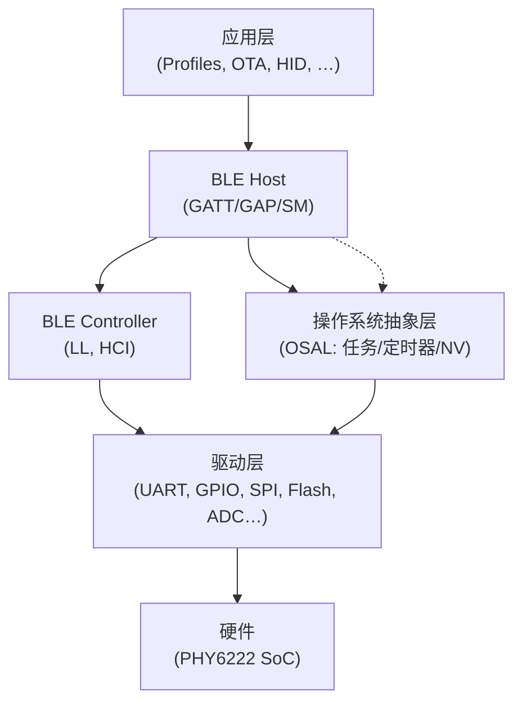
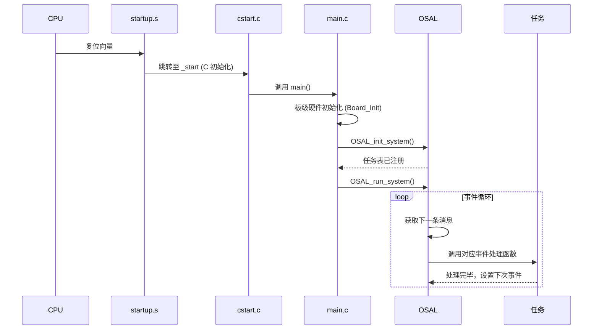
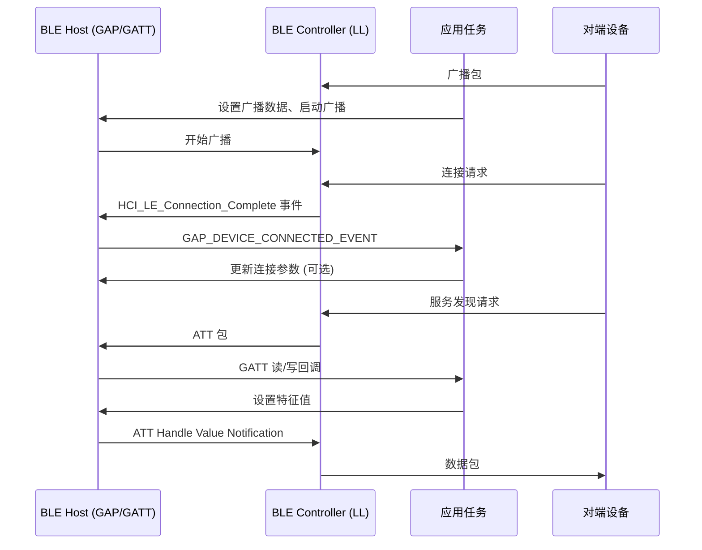
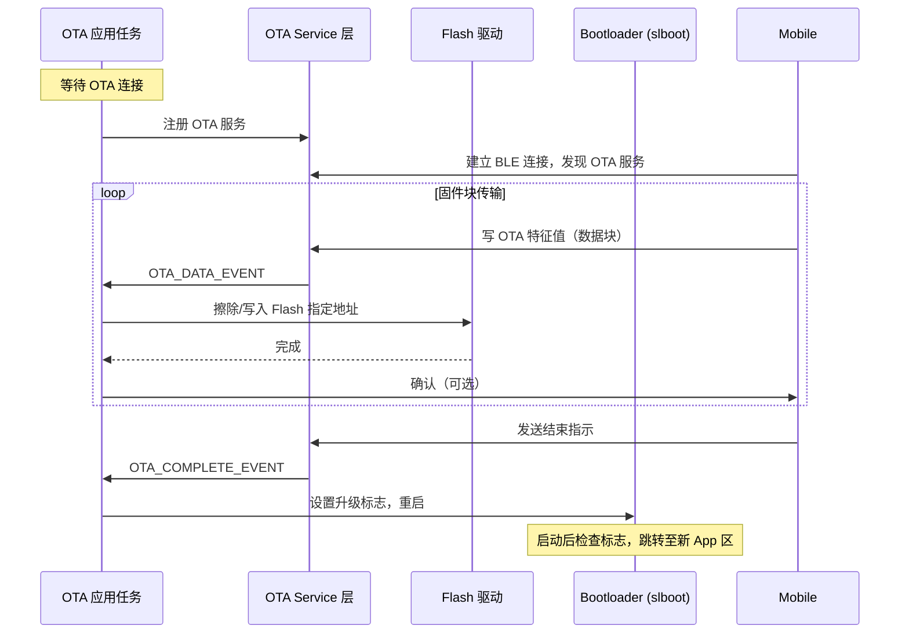

# 项目框架分析报告

## 1. 技术栈分析
- **主语言**: C (基于 `.c`/`.h` 文件、CMSIS 头文件)  
- **硬件平台**: PHY6222 BLE SoC (ARM Cortex-M0 内核)，命名为 `phy6222`、`phy62xx`  
- **BLE 协议栈**: 自研/集成 BLE Controller + Host，包含 HCI、GATT/GAP 层，Mesh 基于 **EtherMind** 库 (`components/ethermind/mesh/export/`)  
- **操作系统抽象**: 自研 OSAL (`components/osal/`)，提供任务调度、定时器、内存管理、NV 存储  
- **构建系统**:  
  - Keil MDK (`.uvprojx` 工程文件，`components/keil/` 下 Flash 算法包)  
  - GCC Makefile (`components/gcc/` 及 `flash.ld` 链接脚本)  
  - YAML 构建脚本 (`_bld_script/`) 用于 CI/版本管理  
- **加密库**:  
  - TinyCrypt 0.2.8 (`components/libraries/tinycrypt-0.2.8/`)  
  - 内置 AES、SHA256、ECC (P256)  
- **其他库**: 文件系统 (`fs/`, `fs2/`), 环形缓冲区, CLI (AT 命令), 控制台, CRC16, xmodem  
- **推断依据**:  
  - 目录名 `gcc/CMSIS/device/phyplus` 与 `keil/` 并存 → 双工具链  
  - `_bld_script/*.yml` 出现 `bld_v306` 等版本号 → 自动化构建  
  - 存在 `ethermind/mesh/export/` → BLE Mesh 方案  
- **不确定项**:  
  - BLE 协议栈是否完全自研、授权，或基于 Nordic SoftDevice 改造？（从文件看更接近自研+第三方 Mesh）  
  - 是否使用 RTOS 或仅依赖裸机 OSAL 循环？(未见 FreeRTOS 等，应仅为 OSAL 事件循环)

## 2. 架构与数据流
系统采用分层架构，从底层硬件驱动到应用 Profiles，经由 OSAL 事件驱动模型串联。  
**Mermaid 架构图**：

**数据流简述**：
1. 系统上电 → `startup.s` → `cstart.c` → `main()` 初始化硬件与 OSAL。
2. `main()` 中调用 `OSAL_init_system()` 创建各任务（如 BLE 任务、应用任务）。
3. OSAL 调度器循环读取消息队列，分发事件到任务处理函数（例如 `SimpleProfile_ProcessEvent`）。
4. BLE 事件（如连接、数据接收）由 BLE Controller 产生，通过 HCI → Host → GATT/Profile 回调应用。
5. 应用处理完后，可调用驱动接口控制外设（如点亮 LED），或通过 GATT 发送数据回客户端。

## 3. 关键模块与事件分析
### 3.1 系统启动与 OSAL 初始化
参与者：启动代码 (`startup.s`, `cstart.c`), `main.c`, OSAL 初始化函数, 各任务。  
流程：硬件复位 → 堆栈/中断配置 → C 环境初始化 → `main()` → 硬件初始化（时钟、 Flash、外设）→ `OSAL_init_system()` 创建任务 → 进入 `OSAL_run_system()` 死循环。

### 3.2 BLE 从机连接与数据收发
参与者：BLE 从机（本设备）, BLE 主机（手机/网关）。  
流程：从机广播 → 主机扫描并连接 → 从机收到连接事件 → GAP 层通知应用 → 连接建立 → 主机发现服务/特征 → 读写特征值 → 应用处理数据。

### 3.3 OTA 固件升级
参与者：OTA 客户端（目标设备），OTA 服务（手机/PC 工具）。  
流程：设备运行 OTA profile 相关任务 → 对端连接并发现 OTA 服务 → 下发固件块 → 设备通过 `ota_flash.c` 写入内部 Flash → 传输完成校验后，系统跳转到新固件区域。

## 4. 快速上手路线
### 一日学习路径（约 6-8 小时）
**上午：环境搭建与编译**
1. 克隆仓库并安装工具链：
   - 推荐使用 **Keil MDK-ARM**（项目中已含 `.pack` 包 `components/keil/kei_flash_FLM调试标准版安装/Keil.PHY62xx.1.1.2.pack`），安装 Pack 及 Flash 编程算法。
   - 若用 GCC，参考 `components/gcc/` 下 Makefile，需 `arm-none-eabi-gcc` 工具链。
2. 打开示例工程：`example/OTA/OTA_internal_flash/ota_if.uvprojx`，编译生成 hex 文件。
3. 烧录工具：使用 J-Link 或专用下载器，参照 `components/keil/.../kei_flash_FLM标准版使用手册_v1.2.docx`。

**下午：理解关键模块并修改**
4. 阅读核心文件（建议顺序）：
   - `components/gcc/CMSIS/device/phyplus/phy6222_cstart.c` — 启动流程
   - `components/osal/include/OSAL_Tasks.h` — 任务定义
   - `example/OTA/OTA_internal_flash/Source/main.c` — 应用入口
   - `components/profiles/SimpleProfile/simpleProfile.c` — 数据收发示例
   - `components/driver/led_light/led_light.c` — LED 控制
5. 调试入口：
   - 在 `main()` 中的 `OSAL_run_system()` 处设置断点，观察任务调度。
   - 在 `SimpleProfile_WriteAttrCB()` 添加断点，捕获手机写操作。
6. 最小修改练习：
   - 修改 `led_light.c` 或示例中的定时器事件，改变 LED 闪烁频率。
   - 通过 AT 命令（`components/libraries/cli/ble_at.c`）添加一条自定义指令，回传芯片温度（读 ADC）。

**常见坑与提示**
- **链接脚本**：工程中的 `scatter_load.sct` (Keil) 或 `flash.ld` (GCC) 严格定义了代码/数据地址，修改闪存布局时务必同步更新。
- **Flash 操作**：OTA 或写内部 Flash 前必须调用 `flash.c` 中的擦除接口，并注意对齐。
- **电源管理**：外设不使用时需关闭时钟以省电（`components/driver/pwrmgr/pwrmgr.c`）。
- **Mesh 功能**：需额外链接 EtherMind 库及平台绑定文件（位于 `components/ethermind/platforms/mesh/`），直接编译 Mesh 示例时注意库路径。

> 附：仓库根目录 `.augment/` 下的技能文件（如 `systematic-debugging`, `test-driven-development`）是 AI 辅助开发工具集，可辅助新人进行调试与计划，但非固件本身代码。